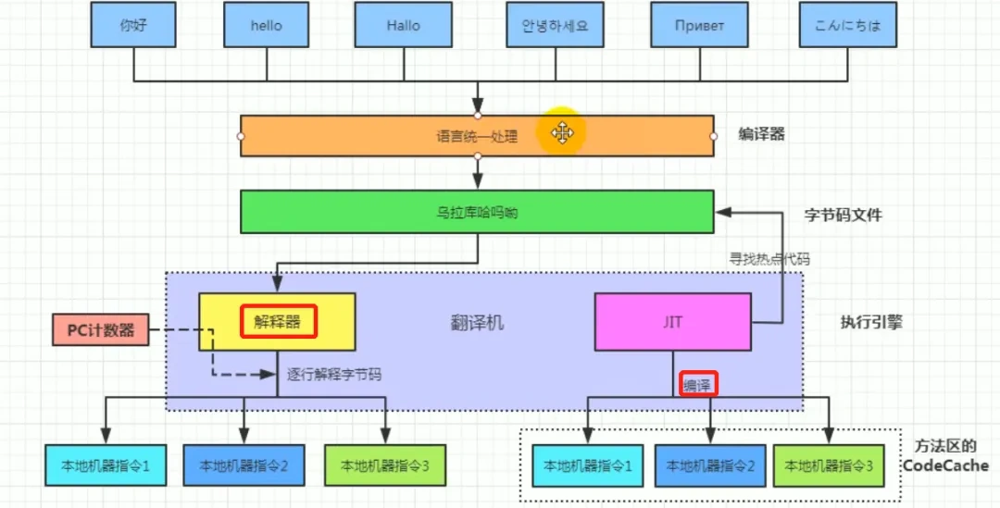
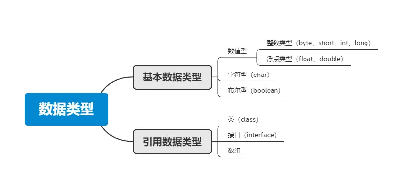

# Java 基础

# 概念

## 优势

- 跨平台：JVM。Java源码编译后生成`.class`​文件（字节码文件），JVM可直接将字节码文件翻译成机器语言从而运行

  - Java程序跨平台，但JVM不是跨平台
- 面向对象
- 生态完善
- 内存管理：自动垃圾回收
- 多线程支持

## 劣势

- JVM性能低于原生编译语言
- 语法繁琐

## JVM/JDK/JRE

- JVM：Java虚拟机

  - 主要工作是解释自己的指令集（即字节码）并映射到本地的CPU指令集和OS的系统调用。（即将Java字节码解释或编译成机器码）
  - 执行Java程序程序
  - 内存管理、垃圾回收、安全性
- JDK：Java开发工具包

  - 包含JVM、编译器（javac）、调试器（jdb），标准库和工具库
  - JDK提供开发、编译、调试和运行Java程序所需的全部工具和环境
- JRE：Java运行时环境

  - Java程序运行所需最小环境
  - 包含JVM和一组Java类库，不包含开发工具，只提供运行环境

## 解释性和编译性

Java同时具有解释性和编译性

- 编译性：在程序执行之前，整个源代码会被编译成机器码或者字节码，生成可执行文件。执行时直接运行编译后的代码，速度快，但跨平台性较差。

  - Java源代码首先被编译成字节码，JIT 会把编译过的机器码保存起来，以备下次使用。
- 解释性：在程序执行时，逐行解释执行源代码，不生成独立的可执行文件。通常由解释器动态解释并执行代码，跨平台性好，但执行速度相对较慢。

  - JVM中的一个方法调用计数器，当累计计数大于一定值的时候，就使用JIT进行编译生成机器码文件，否则就用解释器进行解释执行
  - 字节码也是经过解释器进行解释运行的

# 数据类型

基本数据类型 + 引用数据类型

- 基本数据类型：预定义，不需要实例化
- 引用数据类型：必须实例化，进行内存分配，性能低于基本数据类型。存在空指针问题

## 数据类型的转换方式

- 自动类型转换（隐式转换）：当目标类型的范围大于源类型时，Java会自动将源类型转换为目标类型，不需要显式的类型转换。
- 强制类型转换（显示转换）：当目标类型的范围小于源类型时，需要使用强制类型转换将源类型转换为目标类型。这可能导致数据丢失或溢出。
- 字符串转换：将字符串表示的数据转换为其他类型数据的方法。
- 数值之间转换：数值类型之间的转换方法，如将整型转换为字符型、将字符型转换为整型等。

### 类型互转的问题

- 数据丢失
- 数据溢出
- 精度损失
- 类型不匹配抛出异常

## BigDecimal

高精度数字，涉及金额计算要使用高精度运算

## 包装类

### 装箱和拆箱

- 装箱（Boxing）：基本数据类型->包装类
- 拆箱（Unboxing）：包装类->基本数据类型

发生时间：

- 赋值时
- 方法调用时，传入参数

### 包装类存在意义

- 可以把属性也就是数据跟处理这些数据的方法结合在一起
- 在Java中绝大部分方法或类都是用来处理类类型对象的（如ArrayList），必须包装成类才能被接受。
- 在泛型中需要使用引用类型
- 基本类型需要先转换为包装类，才能通过`toString()`​转换为字符串

## Integer 缓存机制

Integer类内部实现了一个静态缓存池，用于存储特定范围（默认为$[-128,127]$）内的整数值对应的Integer对象。

- 当使用`Integer.valueOf(int)`​（/自动装箱）获取Integer对象时，将直接复用缓存中的现有对象，不会新建。
- 但是如果使用`new`​则仍然会创建新对象

# 面向对象

面向对象是一种编程范式，它将现实世界中的事物抽象为对象，对象具有属性（称为字段或属性）和行为（称为方法）。面向对象编程的设计思想是以对象为中心，通过对象之间的交互来完成程序的功能，具有灵活性和可扩展性，通过封装和继承可以更好地应对需求变化。

## 特点

- **封装**：**将对象的属性（数据）和行为（方法）结合**在一起，对外隐藏对象的内部细节，仅通过对象提供的接口与外界交互。封装的目的是增强安全性和简化编程，使得对象更加独立。
- **继承**：一种可以使得**子类自动共享父类数据结构和方法**的机制。它是代码复用的重要手段，通过继承可以建立类与类之间的层次关系，使得结构更加清晰。
- **多态：允许不同类的对象对同一消息作出响应。** 即同一个接口，使用不同的实例而执行不同操作。多态性可以分为编译时多态（重载）和运行时多态（重写）。它使得程序具有良好的灵活性和扩展性。

## 多态

### 应用

- 方法重载 Overload

  - 同名方法，但是有不同的参数列表（参数类型、数量、顺序），编译器在编译时会选择性调用
- 方法重写 Override

  - 子类能够提供对父类中同名方法的具体实现。运行时根据对象实际类型决定调用的方法
- 接口

  - 多个类可以实现同一个接口，并且用**接口类型的引用**来调用这些类的方法
- 向上转型（认子作父）

  - 使用父类类型引用指向子类类型，可以使用多种子类
- 向下转型

  - 将父类类型引用转回子类类型，需要确定能够转换

### 作用

- 可以使子类替换父类
- 提高代码扩展性，基于接口而非实现编程

## 面向对象的设计原则

1. 单一职责原则（SRP）：一个类应该只有一个引起它变化的原因，即一个类应该只负责一项职责。
2. 开放封闭原则（OCP）：软件实体应该对扩展开放，对修改封闭。
3. 里氏替换原则（LSP）：子类对象应该能够替换掉所有父类对象。
4. 接口隔离原则（ISP）：客户端不应该依赖那些它不需要的接口，即接口应该小而专。（如：通过接口抽象层来实现底层和高层模块之间的解耦）
5. 依赖倒置原则（DIP）：高层模块不应该依赖低层模块，二者都应该依赖于抽象；抽象不应该依赖于细节，细节应该依赖于抽象。
6. 最少知识原则（Law of Demeter）：一个对象应当对其他对象有最少的了解，只与其直接的朋友交互。

## 抽象类

类定义`abstract`​

- 抽象类不能被实例化（即不能使用`new`​创建），只能被继承

  - 抽象类可以拥有构造器（由子类间接调用的，和普通父类一样）
- 抽象类的方法可以没有实现（也可以有）
- 一般作为基类，被其他类继承和扩展使用（不能加`final`​修饰）

### 抽象类和接口

特点：

- 抽象类：用于描述类的共同特性和行为，可以有成员变量、构造方法和具体方法。适用于有明显继承关系的场景。
- 接口：用于定义行为规范，可以多实现，只能有常量和抽象方法。适用于定义类的能力或功能。

区别：

- 一个类可以实现多个接口，但只能继承一个抽象类
- 接口只有定义，没有实现（Java 8 后可以使用 `default`​ 定义方法体）；抽象类可以选择实现或不实现
- 访问修饰符

  - 接口成员变量默认为`public static final`​且必须有初值，无法被修改；成员方法为`public abstract`​
  - 抽象类成员变量默认为`default`​，可被重新赋值；抽象方法被`abstract`​修饰
- 变量：抽象类可以包含实例变量和静态变量，而接口只能包含静态常量。

## 接口

接口里可以定义的方法

- 抽象方法；所有实现接口的类都必须实现这些方法。抽象方法默认是 `public`​ 和`abstract`​，修饰符可以省略。
- 默认方法（Java 8）：允许接口提供具体实现，可以被实现类重写
- 静态方法（Java 8）：属于接口本身，通过接口名直接调用，不需要实现类
- 私有方法（Java 9）：辅助接口中的默认方法或其他私有方法（静态方法只能调用静态私有方法）实现功能，不能被实现类访问，只能在接口内部使用

接口中不能有构造方法，接口不拥有实例

## 静态变量和静态方法

与类本身关联的，不与类的实例关联。在内存中只存在一份，可以被类的所有实例共享。

### 静态变量

static修饰，特点：

- 共享性：所有该类的实例共享同一个静态变量
- 静态变量在类被加载时初始化，只会对其进行一次分配内存。
- 静态变量可以直接通过类名访问，也可以通过实例访问

### 静态方法

static修饰，特点：

- 无实例依赖
- 可访问静态成员，不可访问非静态成员
- 多态性：静态方法不支持重写（Override），但可以被隐藏（Hide）。

### 非静态内部类和静态内部类

- 非静态内部类依赖于外部类的实例，静态内部类不依赖
- 非静态内部类可访问外部类的成员变量和方法，静态内部类只能访问静态成员
- 非静态内部类不能定义静态成员，而静态内部类可以定义静态成员
- 非静态内部类在外部类实例化后才能实例化，而静态内部类可以独立实例化
- 非静态内部类可以访问外部类的私有成员，而静态内部类不能直接访问外部类的私有成员，需要通过实例化外部类来访问

### 

‍
