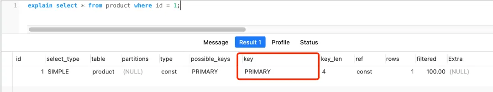
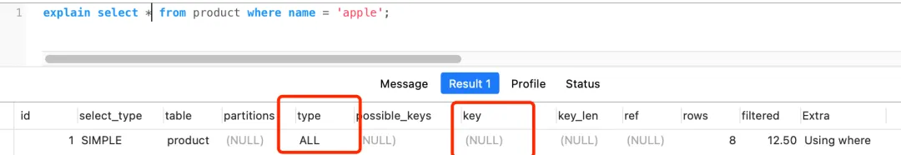

# MySQL

# 基础

## MySQL 执行流程


### MySQL 架构

MySQL 架构分为两层：Server 层和存储引擎层

- Server 层负责**建立连接、分析和执行 SQL。**

  - MySQL 大多数的核心功能模块都在这实现，主要包括**连接器**，**查询缓存**、**解析器**、**预处理器**、**优化器**、**执行器**等。
  - 另外，所有的**内置函数**（如日期、时间、数学和加密函数等）和所有**跨存储引擎**的功能（如存储过程、触发器、视图等）都在 Server 层实现。
- 存储引擎层负责**数据的存储和提取。**

  - 支持 InnoDB、MyISAM、Memory 等多个存储引擎，不同的存储引擎共用一个 Server 层。现在最常用的存储引擎是 **InnoDB**，从 MySQL 5.5 版本开始， InnoDB 成为了 MySQL 的默认存储引擎。
  - 索引数据结构，就是由存储引擎层实现的，不同的存储引擎支持的索引类型也不相同，比如 InnoDB 支持索引类型是 **B+ 树** ，且是默认使用，也就是说在数据表中创建的主键索引和二级索引默认使用的是 B+ 树索引。

### 1. 连接器

使用 MySQL，必须先连接 MySQL 服务，然后才能执行 SQL 语句

```bash
# -h 指定 MySQL 服务的 IP 地址，如果连接本地服务可以不使用该参数
# -u 指定用户名，管理员为 root
# -p 指定密码，如果命令行中不填写密码，则需要在交互对话窗口中指定
mysql -h$ip -u$user -p
```

1. MySQL 基于 TCP 协议传输，连接过程需要经过 TCP 三次握手

3. 如果验证通过，连接器就会获取该用户的权限并保存，后续该用户在此连接里的任何操作，都会基于连接开始时读到的权限来进行权限逻辑的判断

   1. 即如果一个用户已经建立了连接，即使管理员中途修改了该用户的权限，也不会影响已经存在连接的权限，必须再新建连接才会使用新的权限设置

#### 查询客户端连接数

使用 `show processlist`​ 查看 MySQL 服务被多少个客户端连接

Command 列状态为 `sleep`​，表示该用户连接 MySQL 服务后就没有执行过任何命令，即该连接为一个空闲连接，根据 Time 列可知空闲时长

#### 空闲连接处理

MySQL 定义了空闲连接的最大空闲时长（`wait_timeout`​），默认值为 8 小时（28880），如果超过则连接器就会自动断开该连接

一个处于空闲状态的连接被服务端主动断开后，这个客户端并不会马上知道，等到客户端在发起下一个请求的时候，才会收到报错

#### 最大连接数

MySQL 服务支持的最大连接数由 max_connections 参数控制，超过这个值，系统就会拒绝接下来的连接请求，并报错提示 

#### 短连接&长连接

```text
// 短连接
连接 mysql 服务（TCP 三次握手）
执行sql
断开 mysql 服务（TCP 四次挥手）

// 长连接
连接 mysql 服务（TCP 三次握手）
执行sql
执行sql
执行sql
....
断开 mysql 服务（TCP 四次挥手）
```

使用长连接的好处就是可以减少建立连接和断开连接的过程，所以一般是推荐使用长连接。

但是，使用长连接后可能会占用内存增多，因为 MySQL 在执行查询过程中**临时使用内存管理连接对象**，这些连接对象资源只有在连接断开时才会释放。如果长连接累计很多，将导致 MySQL 服务占用内存太大，有可能会被系统强制杀掉，这样会发生 MySQL 服务异常重启的现象。

#### 解决长连接占用内存问题

1. 定期断开长连接
2. 客户端主动重置连接

### 2. 查询缓存

连接器完成连接后，客户端便可以向 MySQL 服务发送 SQL 语句，MySQL 服务收到 SQL 语句后，会先解析 SQL 语句的第一个字段判断是什么类型的语句

- 如果是查询语句（`select`​），MySQL 就会先去查询缓存（Query Cache）里查找缓存数据，查看该条命令是否曾经执行过，该查询缓存以 **Key-value** 的形式存储在内存中

  - key：SQL 查询语句
  - value：SQL 语句查询的结果
- 查询的语句命中，直接返回 value
- 如果查询的语句没有命中查询缓存，则继续执行；执行完后将查询结果存入查询缓存中

但是对于更新比较频繁的表，查询缓存的命中率很低的，因为只要一个表有更新操作，那么这个表的查询缓存就会被清空。如果刚缓存了一个查询结果很大的数据，还没被使用的时候，刚好这个表有更新操作，查询缓冲就被清空了，相当于缓存了个寂寞。

所以，MySQL 8.0 版本直接将查询缓存删掉了，也就是说 MySQL 8.0 开始，执行一条 SQL 查询语句，不会再走到查询缓存这个阶段了。

对于 MySQL 8.0 之前的版本，如果想关闭查询缓存，我们可以通过将参数 query\_cache\_type 设置成 DEMAND。

### 3. 解析器

在正式执行 SQL 查询语句之前，MySQL 会先对 SQL 语句做解析，由解析器完成

- 词法分析：MySQL 会根据输入的字符串识别关键字，构建出 SQL 语法树，便于后续模块获取 SQL 类型、表名、字段名、 where 条件等等。
- 语法分析：根据词法分析的结果，语法解析器会根据语法规则，判断输入的 SQL 语句是否满足 MySQL 语法。

  - 如果输入的 SQL 语句语法错误，或者数据表或者字段不存在，都会在解析器这个阶段报错。

### 4. 优化器

经过解析器之后，在执行 SQL 查询语句之前，会检查用户是否具有访问该数据库/表的权限（因为要先解析出访问哪一个数据库/表，才能去查询权限），若无权限则报错。

若有权限，则执行 SQL 查询语句。在 SQL 查询语句执行之前需要先制定一个执行计划，由**优化器**来完成。

- **优化器主要负责确定 SQL 查询语句的执行方案**：比如在表里面有多个索引的时候，优化器会基于查询成本的考虑，来决定选择使用哪个索引。

要想知道优化器选择了哪个索引，可以在查询语句最前面加个 explain 命令，这样就会输出这条 SQL 语句的执行计划，然后执行计划中的 key 就表示执行过程中使用了哪个索引，比如

- 下图的 key 为 PRIMARY 就是使用了主键索引。

  
- 如果查询语句的执行计划里的 key 为 null 说明没有使用索引，那就会全表扫描（type = ALL），这种查询扫描的方式是效率最低档次的

  
- 如果表中有主键索引和普通索引，且执行 `select id from product where id > 1  and name like 'i%';`​，这条查询语句的结果既可以使用主键索引，也可以使用普通索引，但是执行的效率会不同。这时，就需要优化器来决定使用哪个索引了。

  - 这条查询语句是**覆盖索引**，直接在二级索引就能查找到结果（因为**二级索引的 B+ 树的叶子节点的数据存储的是主键值**），就没必要在主键索引查找了，因为查询主键索引的 B+ 树的成本会比查询二级索引的 B+ 的成本大，优化器基于查询成本的考虑，会选择查询**代价小的普通索引**。二级->一级->查值

### 5. 执行器

经历完优化器后，就确定了执行方案，接下来 MySQL 就真正开始执行语句了，这个工作是由**执行器**完成的。在执行的过程中，执行器就会和存储引擎交互了，交互是以**记录**为单位的。

三种执行过程：

1. 主键索引查询
2. 全表扫描
3. 索引下推

#### 主键索引查询

‍

#### 全表扫描

‍

#### 索引下推

‍

# 锁

- 全局锁：全库逻辑备份
- 表级锁

  - 表锁
  - 元数据锁：CRUD：MDL读锁；表结构：MDL写锁
  - 意向锁：插入更新删除时，先加意向锁，再加独占锁，意向锁可以快速判断表里是否有记录被加锁
- 行级锁：只有（如update）处理主键或索引时，才会加行级锁，否则将进行全表扫描，所有记录都会被加锁（记录锁和间隙锁），相当于锁住全表
- 记录锁
- 间隙锁
- 临键锁

# 日志
