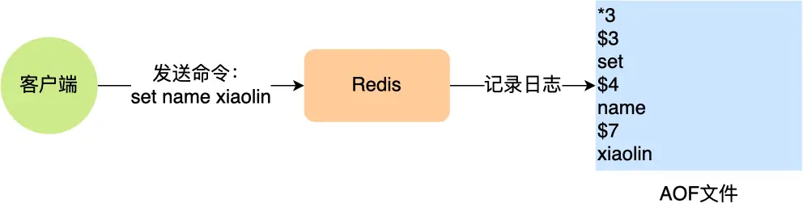

# Redis

# 认识 Redis

## Redis 是什么

- 基于内存的数据库，读写速度快，高性能
- 用于缓存，消息队列、分布式锁
- 操作有原子性，执行命令由单线程负责，不存在并发竞争
- 支持事务 、持久化、Lua 脚本、多种集群方案（主从复制模式、哨兵模式、切片机群模式）、发布/订阅模式，内存淘汰机制、过期删除机制

# Redis 数据结构


- String：缓存对象、常规计数、分布式锁、共享 Session 信息
- List：消息队列（生产者需实现全局唯一 ID；无法实现消费组）
- Hash：缓存对象、购物车
- Set：聚合计算（并交差）：点赞、共同关注、抽奖
- Zset：排序场景：排行榜、姓名排序
- BitMap：二值状态统计：签到、用户登录状态
- HyperLogLog：海量数据技术统计场景：百万级网页 UV 计数
- GEO：地理位置信息场景：打车、地图
- Stream：消息队列（实现全局唯一 ID，支持消费组）

## 内部实现


### String

String 底层由**简单动态字符串（Simple Dynamic String, SDS）** 实现

- SDS 可以保存文本数据和二进制数据（如图片、视频等）

  - 使用 `len`​ 来判断字符串是否结束
- SDS 以 **O(1)** 时间获取长度（`len`​)
- SDS API 是安全的，拼接字符串不会导致缓冲区溢出

### List

**双向链表**或**压缩列表**

- 元素个数小于 512，每个元素值小于 64 字节，使用压缩列表
- 否则使用**双向链表**​
- 3.2 后使用 **quicklist**​

### Hash

**压缩列表**或**哈希表**

- 元素个数小于 512，每个元素值小于 64 字节，使用压缩列表
- 否则使用哈希表
- 7.0 后使用 **listpack**​

### Set

**哈希表**或**整数集合**

- 元素均为整数且个数小于 512，使用**整数集合**
- 否则使用**哈希表**

### ZSet

**压缩列表**或**跳表**

- 元素个数小于 128，每个元素值小于 64 字节，使用**压缩列表**
- 否则使用**跳表**
- 7.0 后使用 **listpack**

# Redis 线程模型​​

单线程：“**接收客户端请求-&gt;解析请求 -&gt;进行数据读写等操作-&gt;发送数据给客户端**”这个过程是由一个主线程完成的

但是 Redis 程序不是单线程的，启动是会开启**后台线程（BIO）**

- 2.6，两个后台线程：关闭文件、AOF 刷盘
- 4.0，三个后台线程：关闭文件、AOF 刷盘、lazyfree 异步释放（`del`​ 主线程处理，`unlink` ​异步删除）


## 单线程模式


### Redis 初始化

1. ​`epoll_create()` ​创建 epoll 对象，`socket()` ​创建服务端​socket
2. ​`bind()` ​绑定端口，`listen()` ​监听 socket
3. ​`epoll_ctl()` ​将 `listen socket` ​加入 epoll，注册**连接事件**处理函数

### 事件循环函数

1. 调用**处理发送队列函数**，查看发送队列中是否有任务

   1. 存在发送任务，`write()` ​将客户端发送缓存区里的数据发送。若这一轮数据未发送完，注册**写事件处理函数**，等待 `epoll_wait()` ​发现可写后再处理
2. 调用 `epoll_wait()` ​等待事件到来，以到来事件类型调用对应处理函数

   1. 连接事件

      1. 调用 `accpet` ​获取已连接的 socket
      2. 调用 `epoll_ctl` ​将已连接的 socket 加入到 epoll
      3. 注册读事件处理函数
   2. 读事件

      1. 调用 `read()` ​获取客户端发送数据
      2. 解析、处理命令
      3. 客户端对象添加到发送队列
      4. 执行结果写到发送缓存区等待发送
   3. 写事件

      1. ​`write()` ​发送客户端发送缓存区的数据
      2. 若这一轮数据未发送完，继续注册**写事件处理函数**，等待 `epoll_wait()` ​发现可写后再处理

## 单线程为什么这么快

- 大部分操作在内存中完成，**CPU 并不是制约 Redis 性能表现的瓶颈所在**
- 单线程模型避免多线程竞争，减少上下文切换，避免死锁
- I/O 多路复用机制处理大量客户端 Socket 请求

  - select/epoll 机制
  - 同时监听多个 socket，一旦有请求到达就会交给 Redis 处理

## 6.0 引入多线程

- 使用多个 I/O 线程处理网络请求
- 但是对于命令执行仍是单线程

一般会创建以下线程：

- Redis-server：Redis 的主线程，主要负责执行命令；
- bio_close_file、bio_aof_fsync、bio_lazy_free：三个后台线程，分别异步处理关闭文件任务、AOF 刷盘任务、释放内存任务
- io_thd_1、io_thd_2、io_thd_3：三个 I/O 线程，io-threads 默认是 4 ，所以会启动 3（4-1）个 I/O 多线程，用来分担 Redis 网络 I/O 的压力

# Redis 持久化

3 种持久化方式：

- AOF 日志：每执行一条写操作，追加该命令到一个文件
- RDB 快照：将某一时刻的数据写入磁盘
- 混合持久化方式：4.0 新增，结合两者

## AOF 日志

Append Only File

- 每执行一条写操作，追加该命令到一个文件。
- Redis 重启时读取该文件，逐一执行命令恢复数据


### 日志内容



- ​`*3` ​表示当前命令有三个部分，每部分都是以 `+数字` ​开头，后面跟具体的命令、键或值。
- 数字表示这部分中的命令、键或值一共有多少字节

### 执行顺序

- Redis 先执行命令，再把命令追加到 `server.aof_buf`​ 缓冲区
- ​`write()` ​系统调用，缓冲区数据写入 AOF 文件（拷贝到内核缓冲区）
- 内核将数据写入硬盘

优点：

- 避免额外检查开销
- 不会阻塞写操作命令

缺点：

- 数据可能丢失（在两个操作间隙 Redis 宕机）
- 阻塞其他操作（AOF 日志在主线程中执行）

### AOF 写回策略

即控制写入硬盘的策略

- Always：每次执行完写操作后写入硬盘
- Everysec：每隔一秒写入硬盘
- No：由操作系统决定写入硬盘时机


### AOF 重写

扫描数据库中所有数据，逐一把内存数据的键值对转换成一条命令，再将命令记录到重写日志​

#### 重写机制

AOF 重写机制：当文件大小超过阈值，压缩 AOF 文件

方式：在重写时，读取数据库所有键值对，将每一个键值对用一条命令记录到新的 AOF 文件（即只保留，对同一键值对的多个写操作中，最新的一条）

#### 重写过程

由后台**子进程** bgrewriteaof 执行

- 并行处理，避免阻塞主进程
- 子进程带有主进程的数据副本（不是线程）。父子进程共享内存数据（只读，写时复制）

触发重写机制后，主进程创建重写 AOF 子进程，重写子进程只读数据，将内存数据键值对转为成命令，再写入日志

#### 重写缓冲区


在重写 AOF 期间，当 Redis 执行完一个写命令后（修改数据，发生写时复制，父子进程不再共享相同数据），会同时将该命令追加入 **AOF 缓冲区**和 **AOF 重写缓冲区**

- 当子进程完成 AOF 重写工作，会向主进程发送异步信号
- 主进程收到信号，调用信号处理函数

  - 将 AOF 重写缓冲区的所有内容追加到新文件
  - 新文件改名，覆盖旧文件

## RDB 快照

Redis Database

记录某一时刻的内存数据

### 做快照过程

- ​`save`​：在主线程生成 RDB 文件
- ​`bgsave`​：创建子进程来生成

Redis 的快照为**全量快照**，会保存内存中的所有数据

### 写时复制

在做快照过程中，主进程可同时处理命令（数据可修改），可见 xv6 进程部分

- 只读：共享数据
- 发生写操作：进行复制，对副本数据做快照

## 混合持久化

- RDB 优点是数据恢复速度快，但是快照的频率不好把握。频率太低，丢失的数据就会比较多，频率太高，就会影响性能。
- AOF 优点是丢失数据少，但是数据恢复不快。

混合持久化

- 在 AOF 重写日志时，fork 出来的重写子进程会先将与主线程共享的内存数据以 RDB 方式写入到 AOF 文件
- 然后主线程处理的操作命令会被记录在**重写缓冲区**里
- 重写缓冲区里的增量命令会以 AOF 方式写入到 AOF 文件
- 写入完成后通知主进程将新的含有 RDB 格式和 AOF 格式的 AOF 文件替换旧的的 AOF 文件

即 AOF 文件的**前半部分是 RDB 格式的全量数据，后半部分是 AOF 格式的增量数据。**

优点：

- 开头为 RDB 的格式，使得 Redis 可以更快的启动
- 结合 AOF 的优点，有减低了大量数据丢失的风险

缺点：

- AOF 文件中添加了 RDB 格式的内容，使得 AOF 文件的可读性变得很差
- 兼容性差（4.0 版本后）

# Redis 集群

## 服务高可用

### 主从复制


读写分离

- 主服务器可进行读写操作

  - 当发生写操作时自动将写操作发送给从服务器
- 从服务器只读，接收主服务器的写操作

主服务器向从服务器发送写命令，不会等待从服务器响应（异步），无法实现强一致性

### 哨兵模式

主从服务出现宕机需要手动恢复

哨兵模式：监控主从服务器，提供主从节点故障转移


### 切片集群

当缓存数据量过大，需要使用切片集群，将数据分布在多个服务器上

- 采用哈希槽（Hash Slot）处理数据和节点的映射关系

  - 根据 key，以 CRC16 算法计算 16bit 的值
  - 该值对 16384 取模

#### 映射方案

- 平均分配：使用 `cluster create` ​创建集群时，自动平均分配哈希槽
- 手动分配：`cluster meet` ​手动创建节点连接，组成集群。`cluster addslots` ​指定哈希槽数量（且必须将 16384 个哈希槽全部进行分配）


## 集群脑裂问题

集群脑裂会产生数据丢失

1. 在 Redis 主从架构中，一般使用**一主多从**的部署方式。
2. 如果发生主节点网络丢失，和从节点失联，但是主节点和客户端仍然正常通信，客户端向失联的主节点写入数据。主节点将新写入的数据缓存到缓冲区内，但是由于网络问题无法将数据同步给从节点
3. 之后哨兵发现主节点失联，会在从节点中重新选择一个节点，此时就会存在两个主节点
4. 这样当网络恢复正常时，旧的主节点重新接入，但是由于哨兵已经选取出了新的主节点，那么旧主节点就需要降级为从节点（记为 A 节点）
5. 当 A 节点被降级后，会向新的主节点请求数据同步。而第一次数据同步为全量同步，此时 A 结点会先清空本地数据，再做全量同步，会导致网络丢失阶段写入 A 节点的数据全部丢失，即集群产生脑裂数据丢失

### 解决方案

当主节点发现**从节点下线**或者**通信超时的总数量小于阈值**时，禁用主节点进行写数据，并返回错误回客户端

- ​`min-slaves-to-write x`​：主节点必须有至少 x 个从节点连接，否则会禁止写数据
- ​`min-slaves-max-lag x`​：主从数据复制和同步的延迟不能超过 x 秒，否则会禁止写数据

即设置：主库连接的从库中至少有 N 个从库，和主库进行数据复制时的 ACK 消息延迟不能超过 T 秒，否则，主库就不会再接收客户端的写请求了

这样无论是主节点发生故障还是网络故障，原主节点都会被限制接收客户端写请求，随后选举产生新主节点，由新主节点进行处理，就不会导致脑裂数据丢失问题了

# Redis 过期删除与内存淘汰 Evict（驱逐）

## 过期删除实现

每当对一个 key 设置了过期时间，Redis 会将该 key 以及过期时间存储到**过期字典（expires dict）** 中

- 查询 key 时，首先检查该 key 是否存在于该过期字典中

  - 如果不在，正常读取键值
  - 如果存在，获取过期时间，与当前系统时间比对，大于系统时间则没有过期，否则过期

## 过期删除策略

**惰性删除 + 定期删除**

### 惰性删除策略

不主动删除过期键，只当访问 key 时，判断是否过期，如果过期则删除

​

优点：

- 每次访问时才会检查过期情况，CPU 资源占用小

缺点：

- 已过期 key 仍然保留在内存中，内存空间浪费

### 定期删除策略

每个一段时间**随机**从数据库中取出**一定数量**的 key 进行检查，并删除其中过期的 key

流程：

1. 从过期字典中随机抽取 20 个 key
2. 检查这 20 个 key 是否过期，并删除已过期的 key
3. 如果本轮检查的已过期 key 数量占全部抽取数量 25% 以上，则重复步骤一

​

优点：

- 限制删除操作执行的时长和频率，减少删除操作对 CPU 的影响，同时也能删除一部分过期数据，减少过期键对空间的无效占用

缺点：

- 难以确定删除操作执行的时长和频率

  - 执行太频繁：CPU 不友好
  - 执行太少：退化成惰性删除，占用内存

## 持久化时处理过期键

### AOF

- AOF 文件写入阶段：如果数据库某个过期键没被删除，AOF 文件会**保留此键**，当该过期键被删除后，Redis 向 AOF 文件追加 `DEL` ​命令显式删除该键
- AOF 重写阶段：过期键不会被保存在重写后的 AOF 文件中，即不会对 AOF 重写造成任何影响

### RDB

- RDB 文件生成阶段：过期键不会被保存在 RDB 文件中
- RDB 加载阶段

  - 主节点：载入 RDB 文件时，检查键，不会载入过期键
  - 从节点：载入所有键，但是主从节点进行数据同步时，从服务器的数据会被清空，所以过期键不会造成影响

## 主从模式处理过期键

- 主节点：key 过期，在 AOF 文件中增加 `DEL` ​指令，并同步到所有从节点
- 从节点：不进行过期扫描，等待主节点 `DEL` ​命令同步时才删除

# Redis 内存淘汰

​`maxmemory`​

## 内存淘汰策略

八大策略

### 不进行数据淘汰策略

- noeviction：当前运行内存超过最大设置内存时，不淘汰任何数据，但是不再提供服务，直接返回错误（Redis3.0 后的默认策略）

### 进行数据淘汰策略

- 设置过期时间的数据中淘汰

  - **volatile-random**：随机淘汰设置了过期时间的任意键值
  - **volatile-ttl**：优先淘汰更早过期的键值
  - **volatile-lru**（Redis3.0 之前，默认的内存淘汰策略）：淘汰所有设置了过期时间的键值中，最久未使用的键值
  - **volatile-lfu**（Redis 4.0 后新增的内存淘汰策略）：淘汰所有设置了过期时间的键值中，最少使用的键值
- 所有数据范围内淘汰

  - **allkeys-random**：随机淘汰任意键值
  - **allkeys-lru**：淘汰整个键值中最久未使用的键值
  - **allkeys-lfu**（Redis 4.0 后新增的内存淘汰策略）：淘汰整个键值中最少使用的键值

#### LRU

**最近最少使用**

Redis 实现近似 LRU 算法

- 在对象结构体中添加一个额外的字段，用于记录此数据的最后一次访问时间
- 进行内存淘汰时，使用**随机采样**的方式淘汰数据，随机取多个值，淘汰最久未使用的数据

优点：

- 不用为所有数据维护大链表，节省空间
- 不用在每次数据访问时都移动链表项，提升缓存性能

但是无法解决缓存污染问题：一次读取大量数据，难以批量删除，长期存储在缓存中。因此引入 LFU

### LFU

**最近最不常用的**：根据访问次数来淘汰数据

LFU 算法会记录每个数据的访问次数。当一个数据被再次访问时，增加该数据访问次数

- Redis 多记录了**数据访问频次**信息

  ```c
  typedef struct redisObject { 
  	... 
  	// 24 bits，用于记录对象的访问信息 
  	unsigned lru:24; 
  	... 
  } robj;
  ```
- Redis 对象头中的 lru 字段，在 LRU 算法下和 LFU 算法下使用方式并不相同

  - LRU：记录 key 的访问时间戳
  - LFU：被分成两段来存储

    - 高 16bit 存储 ldt（Last Decrement Time），记录 key 的访问时间戳
    - 低 8bit 存储 logc（Logistic Counter），记录 key 的访问频次

# Redis 缓存设计

## 缓存雪崩


缓存雪崩：大量缓存数据在同一时间过期（失效）时，如果此时有大量的用户请求，都无法在 Redis 中处理，于是全部请求都直接访问数据库，导致数据库压力骤增，可能导致数据库宕机

- 缓存失效时间随机打散：增加随机值
- 设置缓存不过期（逻辑过期）：通过后台服务来更新缓存数据

## 缓存击穿


缓存击穿：如果缓存中的某个热点数据过期了，此时大量的请求访问了该热点数据，就无法从缓存中读取，直接访问数据库，数据库很容易就被高并发的请求冲垮（可以认为是缓存雪崩的子集）

- 互斥锁：`setnx`​ 保证同一时间只有一个业务线程请求缓存，未能获取互斥锁的请求，要么等待锁释放后重新读取缓存，要么返回空值或默认值
- 逻辑过期

## 缓存穿透


缓存穿透：当用户访问的数据，**既不在缓存中，也不在数据库中**，导致请求在访问缓存时，发现缓存缺失，再去访问数据库时，发现数据库中也没有要访问的数据，没办法构建缓存数据，来服务后续的请求。那么当有大量这样的请求到来时，数据库的压力骤增

发生情况：

- 业务误操作：误删除缓存和数据库中的数据
- 恶意攻击

应对方案：

- 限制非法请求：在 API 入口处判断请求参数是否合理：请求参数是否含有非法值、请求字段是否存在
- 设置空值或默认值
- 布隆过滤器：在写入数据库数据时，使用布隆过滤器进行标记，查询时可以快速判断数据是否存在

# Redis 缓存策略

## 热点数据动态缓存

核心思路：**通过数据最新访问时间来做排名，并过滤掉不常访问的数据，只留下经常访问的数据**

1. 先通过缓存系统做一个排序队列（比如存放 1000 个商品），系统会根据商品的访问时间，更新队列信息，越是最近访问的商品排名越靠前
2. 同时系统会定期过滤掉队列中排名最后的 200 个商品，然后再从数据库中随机读取出 200 个商品加入队列中
3. 这样当请求每次到达的时候，会先从队列中获取商品 ID，如果命中，就根据 ID 再从另一个缓存数据结构中读取实际的商品信息，并返回

可以使用 `zadd` ​和 `zrange` ​来完成排序队列和获取商品操作

## 缓存更新策略

- 旁路缓存 Cache Aside：Redis 实际应用
- 读穿/写穿策略 Read/Write Through
- 写回策略 Write Back

### Cache Aside

应用程序直接与数据库、缓存交互，并负责对缓存的维护。可细分为读策略和写策略


- 写策略

  - 先更新数据库中的数据，再删除缓存中的数据（不能颠倒顺序，否则会导致缓存和数据库数据不一致）

  
- 读策略

  - 读取的数据命中缓存，直接返回数据
  - 没有命中缓存，从数据库中读取数据，写入缓存，再返回

**Cache Aside 策略适合读多写少的场景，不适合写多的场景**。

- 当写入比较频繁时，缓存中的数据会被频繁地清理，会对缓存的命中率有一些影响
- 如果对与缓存命中率要求高

  - 更新数据时也更新缓存：需要在更新缓存前加分布式锁，只允许同一时间只有一个线程更新缓存（影响写入性能）
  - 更新数据时也更新缓存，但是给缓存较短的过期时间，即使出现缓存不一致的情况也会很快过期，对业务影响较小（看业务需求）

### Read/Write Through

应用程序只和缓存交互，不再和数据库交互，而是由缓存和数据库交互，相当于更新数据库的操作由缓存自己代理

‍
