# 基础

# 概念梳理

## 进程与线程

### 进程

- 程序由指令和数据组成，但这些指令要运行，数据要读写，就必须将指令加载至 CPU，数据加载至内存。在指令运行过程中还需要用到磁盘、网络等设备。进程就是用来加载指令、管理内存、管理 IO
- 当一个程序被运行，从磁盘加载这个程序的代码至内存，这时就开启了一个进程。
- 进程就可以视为程序的一个实例。大部分程序可以同时运行多个实例进程，也有的程序只能启动一个实例进程

### 线程

- 一个进程之内可以分为一到多个线程
- 一个线程就是一个指令流，将指令流中的一条条指令以一定的顺序交给 CPU 执行
- Java 中，线程作为最小调度单位，进程作为**资源分配的最小单位**。 在 windows 中进程是不活动的，只是作为线程的容器

### 二者对比

- 进程基本上相互独立的，而线程存在于进程内，是进程的一个子集
- 进程拥有共享的资源，如内存空间等，供其内部的线程共享
- 进程间通信较为复杂

  - 同一台计算机的进程通信称为 IPC（Inter-process communication）
  - 不同计算机之间的进程通信，需要通过网络，并遵守共同的协议，例如 HTTP
- 线程通信相对简单，因为它们共享进程内的内存，一个例子是多个线程可以访问同一个共享变量
- 线程更轻量，线程上下文切换成本一般上要比进程上下文切换低

## 并行和并发

- 单核 CPU 下，线程实际还是串行执行的。操作系统中有一个组件叫做任务调度器，将 CPU 的时间片分给不同的程序使用，只是由于 CPU 在线程间（时间片很短）的切换非常快，感觉是 同时运行的 。即：微观串行，宏观并行 ，

  - 一般会将这种**线程轮流使用 CPU** 的做法称为并发（concurrent）
- 多核 cpu 下，每个核（core）都可以调度运行线程，这时候线程可以是并行的

即轮流用（并发），分别用（并行）

- 并发（concurrent）是同一时间应对（dealing with）多件事情的能力
- 并行（parallel）是同一时间动手做（doing）多件事情的能力

### 应用

1. 异步调用
2. 多核并行处理

- 单核 CPU 下，多线程不能实际提高程序运行效率，只是为了能够在不同的任务之间切换，不同线程轮流使用 CPU，不至于一个线程一直占用 cpu，导致别的线程饥饿
- 多核 CPU 可以并行跑多个线程，但能否提高程序运行效率还是要分情况的
- IO 操作不占用 CPU，只是我们一般拷贝文件使用的是阻塞 IO，这时相当于线程虽然不用 CPU，但需要一直等待 IO 结束，没能充分利用线程。所以才有后面的非阻塞 IO 和异步 IO 优化

# Java 线程

## 创建和运行线程

### Thread

1. 创建线程对象
2. 重写线程任务
3. 启动线程 `start()`​

```java
public class Test1 {
    public static void main(String[] args) {
        // 创建线程对象
        Thread t1 = new Thread("t1") {
            // 重写线程任务
            @Override
            public void run() {
                System.out.println(Thread.currentThread().getName() + " is running");
            }
        };
        // t1.setName("t1");
        // 启动线程，注意要用start()而不是run()，使用run()相当于普通调用方法，不是异步调用
        t1.start();
    }
}
```

### Thread + Runnable

将线程和任务分开

- Thread：线程实体
- Runnable（接口）：线程任务

Runnable：

```java
@FunctionalInterface
public interface Runnable {
    /**
     * When an object implementing interface {@code Runnable} is used
     * to create a thread, starting the thread causes the object's
     * {@code run} method to be called in that separately executing
     * thread.
     * &ltp>
     * The general contract of the method {@code run} is that it may
     * take any action whatsoever.
     *
     * @see     java.lang.Thread#run()
     */
    public abstract void run();
}
```

```java
public class Test2 {
    public static void main(String[] args) {
        // 创建任务
        Runnable runnable = new Runnable() {
            @Override
            public void run() {
                System.out.println(Thread.currentThread().getName() + " is running");
            }
        };
        // 创建线程
        Thread thread = new Thread(runnable, "t2");
        // 启动任务
        thread.start();
    }
}
```

- 使用 Runnable 更易与线程池等高级 API 配合
- 用 Runnable 让任务类脱离 Thread 继承体系，更灵活

#### 使用 Lambda 表达式简化

只有一个抽象方法的接口-> 可以使用 Lambda 表达式

```java
public class Test2 {
    public static void main(String[] args) {
        // 创建任务
        Runnable runnable = () -> System.out.println(Thread.currentThread().getName() + " is running");
        // 创建线程
        Thread thread = new Thread(runnable, "t2");
        // 启动任务
        thread.start();
    }
}
```

### Thread + FutureTask + Callable

- FutureTask 能够接收 Callable 类型的参数，用来处理有返回值的情况
- 使用 Thread 或者 Thread + Runnable 是没有返回值的

注意返回结果和报错都会被封装到 Callable 中，必须显式调用才能获取信息

```java
public class Test3 {
    public static void main(String[] args) throws ExecutionException, InterruptedException {
        FutureTask&ltInteger> futureTask = new FutureTask&lt>(new Callable&ltInteger>() {
            @Override
            public Integer call() throws Exception {
                System.out.println("calling...");
                Thread.sleep(1000);
                return 100;
            }
        });

        Thread thread = new Thread(futureTask, "t3");
        thread.start();

        // get() 会导致阻塞
        System.out.println("Before get");
        Integer output = futureTask.get();
        System.out.println("After get");
        System.out.println(output);
    }
}
```

## 查看进程、线程

### 操作系统

windows:

- ​`tasklist`​
- ​`taskkill`​

linux:

- ​`ps -fe`​ 查看所有进程
- ​`ps -fT -p &ltPID>`​ 查看进程的所有线程
- ​`kill`​ 杀死进程
- ​`top`​ 查看进程、线程
- ​`top -H -p &ltPID>`​ 查看进程的所有线程

### Java 查看进程、线程信息

- ​`jps`​ 查看所有 Java 进程
- ​`jstack &ltPID>`​ 查看某个 Java 进程的所有线程状态
- ​`jconsole`​ 查看某个 Java 进程中线程的运行情况（图形界面）

#### jconsole 远程监控配置

以如下方式运行：

```bash
java -Djava.rmi.server.hostname=&ltip地址> -Dcom.sun.management.jmxremote -
Dcom.sun.management.jmxremote.port=&lt连接端口> -Dcom.sun.management.jmxremote.ssl=&lt是否安全连接: true|false> -
Dcom.sun.management.jmxremote.authenticate=&lt是否认证: true|false> java类
```

## 线程运行原理

### 栈与栈帧

Java Virtual Machine Stacks （Java 虚拟机栈）

JVM 中由**堆、栈、方法区**所组成，其中**栈内存**给线程使用，每个线程启动后，虚拟机就会为其分配一块栈内存

- 每个栈由多个**栈帧（Frame）** 组成，对应着**每次方法**调用时所占用的内存（一个方法调用对应一个栈帧，栈帧是线程私有的）

  - 栈帧中有局部变量表、操作数栈、方法出口（方法返回地址）、动态链接
- 每个线程只能有**一个活动栈帧**，对应着当前**正在执行**的那个方法

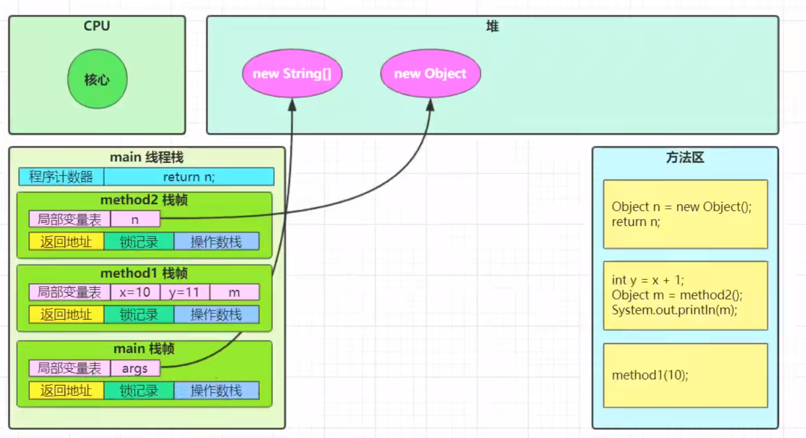

### 线程上下文切换

Thread Context Switch

因为以下一些原因导致 CPU 不再执行当前的线程，转而执行另一个线程的代码

- 线程的 CPU 时间片用完
- 垃圾回收
- 有更高优先级的线程需要运行
- 线程自己调用了 sleep、yield、wait、join、park、synchronized、lock 等方法

当 Context Switch 发生时，需要由**操作系统**保存当前线程的**状态**，并恢复另一个线程的状态，Java 中对应的概念就是**程序计数器（Program Counter Register）** ，它的作用是记住**下一条 JVM 指令的执行地址**，是线程**私有**的

- 状态包括：程序计数器、虚拟机栈中每个栈帧的信息（局部变量、操作数栈、返回地址等）
- Context Switch 频繁发生会影响性能

## 线程 API

|方法名|static|功能|Note|
| ----------------| ------| ----------------------------------------------------------| ----------------------------------------------------------------------------------------------------------------------------------------------------------------------------------------------------------------------------------------------------------------------|
|start()||启动一个新线程，在新的线程运行 run 方法中的代码|start 方法只是让线程进入就绪，里面代码不一定立刻运行（CPU 的时间片还没分给它）。每个线程对象的 start 方法只能调用一次，如果调用了多次会出现 `IllegalThreadStateException`​|
|run()||新线程启动后会调用的方法|如果在构造 Thread 对象时传递了 Runnable 参数，则线程启动后会调用 Runnable 中的 run 方法，否则默认不执行任何操作。但可以创建 Thread 的子类对象，来覆盖默认行为。如果直接调用则是在当前线程执行，只有使用 `start()` ​才会创建新的线程异步执行|
|join()||等待线程运行结束|用于线程通信|
|join(long n)||等待线程运行结束，最多等待 n 毫秒||
|getId()||获取线程 long 类型 id|id 唯一|
|getName()||获取线程名||
|setName(String)||修改线程名||
|getPriority()||获取线程优先级|1. 规定线程优先级是[1, 10]的整数，较大的优先级能提高该线程被 CPU 调度的机率&ltbr />2. 线程优先级会提示（hint）调度器优先调度该线程，但它仅仅是一个提示，调度器可以忽略它&ltbr />3. 如果 cpu 比较忙，那么优先级高的线程会获得更多的时间片，但 cpu 闲时，优先级**几乎没作用**&ltbr />|
|setPriority(int)||修改线程优先级||
|getState()||获取线程状态|NEW, RUNNABLE, BLOCKED, WAITING, TIMED_WAITING, TERMINATED|
|isInterrupted()||判断是否被打断|不会清除**打断标记**|
|isAlive()||判断线程是否存活||
|interrupt()||打断线程|如果被打断线程正在 sleep，wait，join 会导致被打断的线程抛出 `InterruptedException`​，并清除打断标记；如果打断正在运行的线程，则会设置打断标记；park 的线程被打断，也会设置打断标记|
|interrupted()|static|判断当前线程是否被打断|会清除**打断标记**|
|currentThread()|static|获取当前正在执行的线程||
|sleep(long n)|static|让当前执行的线程**休眠** n 毫秒，休眠时让出 CPU 的时间片给其他线程|0. 不会让出锁和资源&ltbr />1. 调用 `sleep()`​ 会让当前线程从 Running 进入 Timed Waiting 状态（阻塞）&ltbr />2. 其它线程可以使用 `interrupt()` ​打断正在睡眠的线程，这时 `sleep()` ​会抛出 `InterruptedException`​&ltbr />3. 睡眠结束后的线程未必会立刻得到执行（还需要等待时间片）&ltbr />4. 建议用 TimeUnit 的 `sleep()`​ 代替 Thread 的 `sleep()`​ 来获得更好的可读性&ltbr />|
|yield()|static|提示线程调度器**让出**当前线程对 CPU 的使用|1. 调用 `yield()`​ 会让当前线程从 Running 进入 Runnable 就绪状态，然后调度执行其它线程，之后再抢到 CPU 后再运行&ltbr />2. 具体的实现依赖于操作系统的任务调度器|

```java
// 使用 TimeUnit 的 sleep()
Thread t1 = new Thread(() -> {
    try {
        TimeUnit.SECONDS.sleep(1);
    } catch (InterruptedException e) {
        throw new RuntimeException(e);
    }
});
t1.start();
```

### 使用 sleep() 防止 CPU 空转

```java
while (true) {
    try {
        Thread.sleep(50);
    } catch (InterruptedException e) {
        throw new RuntimeException(e);
    }
}
```

- 可以用 wait 或者条件变量达到类似效果，但是需要加锁和唤醒操作，适用于进行同步的场景
- ​`sleep()` ​适用于无需锁同步的场景

### join

- 同步：等待结果返回
- 异步：不需要等待结果返回

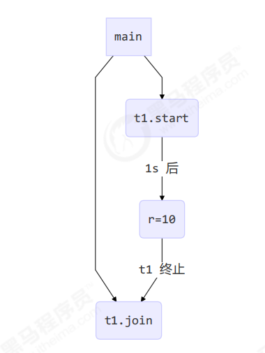

线程会在 `join()` ​处阻塞，直到线程执行结束

#### 应用

```java
private static void test() throws InterruptedException {
    Thread t1 = new Thread(() -> {
        try {
            Thread.sleep(1000);
        } catch (InterruptedException e) {
            throw new RuntimeException(e);
        }
        r1 = 10;
    });
    Thread t2 = new Thread(() -> {
        try {
            Thread.sleep(2000);
        } catch (InterruptedException e) {
            throw new RuntimeException(e);
        }
        r2 = 20;
    });

    long start = System.currentTimeMillis();
    t1.start();
    t2.start();
    t2.join();
    t1.join();
    long end = System.currentTimeMillis();
    System.out.printf("r1: %d, r2: %d, cost: %d", r1, r2, end - start);
}
```

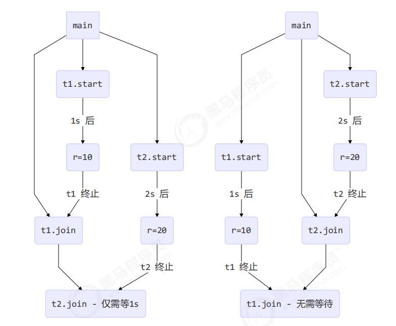

先 `t1.join()`​；先 `t2.join()`​

#### 原理

调用者轮询检查线程 alive 状态

```java
t1.join();
```

等价于：

```java
synchronized (t1) {
    // 调用者线程进入 t1 的 waitSet 等待, 直到 t1 运行结束
    while (t1.isAlive()) {
        t1.wait(0);
    }
}
```

也算保护性暂停，等待的不是返回结果，而是线程结束

### interrupt

#### 打断阻塞状态的线程（sleep，wait，join）

打断阻塞状态的线程，会清空打断状态并抛出异常：`isInterrupted() == false`​

打断状态：用于标记该线程是否被打断过，true 为被打断过，打断阻塞状态的线程是特殊情况。可以用于判断该进程之后还是否会重新运行，true 就表示之后还会运行

#### 打断正常运行的线程

不会清空打断状态：`isInterrupted() == true`​

使用打断标记可以停止线程，当调用 `t1.interrupt()` ​之后，t1 获取到的 `isInterrupted()` ​会变为 true，就可以通过这个布尔值进行停止工作

```java
public class Test6 {
    public static void main(String[] args) throws InterruptedException {
        Thread t1 = new Thread(() -> {
            while (true) {
                boolean interrupted = Thread.currentThread().isInterrupted();
                if (interrupted) {
                    System.out.println("interrupted");
                    break;
                }
            }
        });
        t1.start();
        Thread.sleep(1000);
        t1.interrupt();
    }
}
```

#### 打断 park 线程

不会清空打断状态：`isInterrupted() == true`​

​`park()` ​相当于主动停止线程运行，当有 `interrupt()` ​进行中断时，才会继续运行，且需要打断标记为 false，才能停止，可以在第一次打断后（打断标记变为 true）手动清除打断标记 `Thread.interrupted()`​

```java
public class Test8 {
    public static void main(String[] args) throws InterruptedException {
        Thread t1 = new Thread(() -> {
            System.out.println("park");
            LockSupport.park();
            System.out.println("unpark");
            System.out.println(Thread.currentThread().isInterrupted());
            // 打断标记为真时，park()失效
            LockSupport.park();
        });
        t1.start();
        Thread.sleep(1000);
        t1.interrupt();
    }
}
```

## 主线程和守护线程

默认情况下，Java 进程需要等待所有线程都运行结束，才会结束

**守护线程（Daemon）** ：只要其它非守护线程运行结束了，即使守护线程的代码没有执行完，也会强制结束

```java
public class Test9 {
    public static void main(String[] args) throws InterruptedException {
        Thread t1 = new Thread(() -> {
            while (true) {
                if (Thread.currentThread().isInterrupted()) {
                    break;
                }
            }
            System.out.println("Thread End");
        });
        t1.setDaemon(true);		// 如果不设置守护线程，那么主线程结束后，该线程仍然会运行，即进程不停止
        t1.start();

        Thread.sleep(1000);
        System.out.println("Main end");
    }
}
```

- 垃圾回收器线程就是一种守护线程
- Tomcat 中的 Acceptor 和 Poller 线程都是守护线程，所以 Tomcat 接收到 shutdown 命令后，不会等待它们处理完当前请求

## 线程状态

### 操作系统角度（5 种）

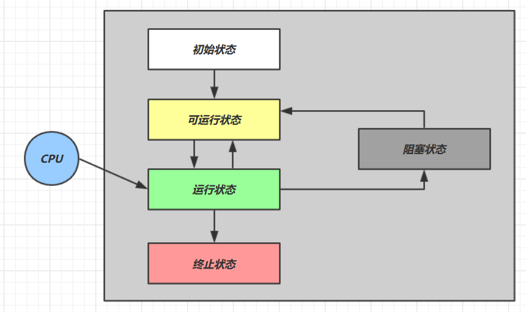

|状态|描述|
| ----------| --------------------------------------------------------------------------------------------------------------------------------------------------------------------------------------------------------------------------------------------------------------------------|
|初始状态|仅是在语言层面创建了线程对象，还未与操作系统线程关联|
|可运行状态|（就绪状态）指该线程已经被创建（与操作系统线程关联），可以由 CPU 调度执行|
|运行状态|获取了 CPU 时间片运行中的状态，当 CPU 时间片用完，会从【运行状态】转换至【可运行状态】，会导致线程的上下文切换|
|阻塞状态|如果调用了阻塞 API，如 BIO 读写文件，这时该线程实际不会用到 CPU，会导致线程上下文切换，进入【阻塞状态】等 BIO 操作完毕，会由操作系统唤醒阻塞的线程，转换至【可运行状态】与【可运行状态】的区别是，对【阻塞状态】的线程来说只要它们一直不唤醒，调度器就一直不会考虑调度它们|
|终止状态|表示线程已经执行完毕，生命周期已经结束，不会再转换为其它状态|

### Java 实现（6 种）

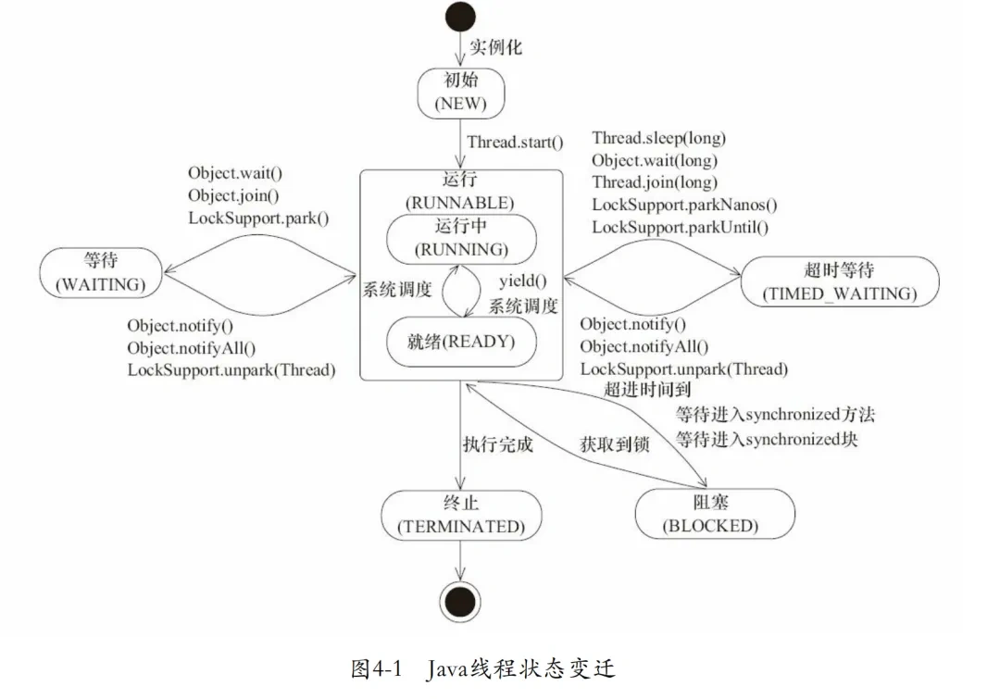

|状态|描述|
| -------------------| ----------------------------------------------------------------------------------------------------------------------------------------------------------------------------------|
|NEW|线程被创建，但是未调用 `start()`​|
|RUNNABLE（RUNNING）|调用了 `start()` ​方法之后，Java API 层面的 RUNNABLE 状态**涵盖了操作系统层面的可运行状态、运行状态和阻塞状态**（由于 BIO 导致的线程阻塞，在 Java 里无法区分，仍然认为是可运行，也就是 Java 线程的 RUNNABLE 状态将操作系统的线程状态进行了封装）|
|BLOCKED|阻塞状态，进入 synchronized 方法|
|WAITING|阻塞状态，线程同步 wait() park() join()|
|TIMED_WAITING|阻塞状态，线程休眠 sleep()|
|TERMINATED|线程代码运行结束|

### 状态转换

假设有线程 `Thread t`​

#### NEW -> RUNNABLE

- ​`t.start()`​

#### RUNNABLE &lt-> WAITING

1. t通过`synchronized(obj)`​获取对象锁后

- ​`obj.wait()`​：**RUNNABLE -&gt; WAITING**
- ​`obj.notify()`​、`obj.notifyAll()`​、`obj.interrupt()`​

  - 竞争锁成功：**WAITING -&gt; RUNNABLE**
  - 竞争锁失败：**WAITING -&gt; BLOCKED**

2. ​`t.join()`​：RUNNABLE -> WAITING

- 当前线程在t线程对象的监视器上等待
- t线程运行结束，或者调用了当前线程的`interrupt()`​，当前线程：WAITING -> RUNNABLE

3. ​`LockSupport.park()`​：RUNNABLE -> WAITING
4. ​`LockSupport.unpark()`​、调用`interrupt()`​：WAITING -> RUNNABLE

#### RUNNABLE &lt-> TIMED_WAITING

1. t线程用`synchronized(obj)`​获取对象锁后

- ​`obj.wait(long n)`​：RUNNABLE -> TIMED_WAITING
- 等待时间超过n毫秒，或者调用`obj.notify()`​、`obj.notifyAll()`​、`t.interrupt()`​

  - 竞争锁成功：**TIMED_WAITING -&gt; RUNNABLE**
  - 竞争锁失败：**TIMED_WAITING -&gt; BLOCKED**

2. ​`t.join(long n)`​同上
3. ​`Thread.sleep(long n)`​：RUNNABLE -> TIMED_WAITING
4. ​`LockSupport.parkNanos(long nanos)`​, `LockSupport.parkUntil(long millis)`​：RUNNABLE -> TIMED_WAITING
5. ​`LockSupport.unpark()`​, `interrupt()`​：TIMED_WAITING -> RUNNABLE

#### RUNNABLE -> BLOCKED

- t 线程用 `synchronized(obj)`​ 获取了对象锁时如果竞争失败，从 RUNNABLE -> BLOCKED
- 持 obj 锁线程的同步代码块执行完毕，会唤醒该对象上所有 BLOCKED 的线程重新竞争，如果其中 t 线程竞争成功，从 BLOCKED -> RUNNABLE ，其它失败的线程仍然 BLOCKED

#### RUNNABLE -> TERMINATED

当前线程所有代码运行完毕，进入 TERMINATED

# 线程共享-管程

## 共享问题

> 两个线程对初始值为 0 的静态变量一个做自增，一个做自减

```java
public class Test10 {
    static int counter = 0;

    public static void main(String[] args) throws InterruptedException {
        Thread t1 = new Thread(() -> {
            for (int i = 0; i &lt 50000; i++) {
                counter++;
            }
        }, "t1");
        Thread t2 = new Thread(() -> {
            for (int i = 0; i &lt 50000; i++) {
                counter--;
            }
        }, "t2");

        t1.start();
        t2.start();
        t1.join();
        t2.join();
        System.out.println(counter);
    }
}
```

- 因为 Java 中对静态变量的自增，自减并不是原子操作，所以最后的结果不一定是 0
- 例如对于 i++ 而言（i 为静态变量），实际会产生如下的 JVM 字节码指令

  ```text
  getstatic i 	// 获取静态变量i的值
  iconst_1 		// 准备常量1
  iadd 			// 自增
  putstatic i 	// 将修改后的值存入静态变量i
  ```
- 完成静态变量的自增，自减需要在主存和工作内存中进行数据交换。串行不会产生影响，但是两者并行，会导致指令交错执行，前一步读取的 i 下一步被修改了，拿到的是旧版本

### 临界区 Critical Section

- 问题出在多个线程访问共享资源

  - 多个线程读共享资源没有问题
  - 问题在于多个线程对共享资源读写操作时发生指令交错
- 一段代码块内如果存在对**共享资源的多线程读写操作**，称这段代码块为**临界区**

### 静态条件 Race Condition

多个线程在临界区内执行，由于**代码的执行序列不同**而导致结果无法预测，称之为发生了**竞态条件**

为了避免临界区的竞态条件发生，有多种手段可以达到目的

- 阻塞式的解决方案：synchronized，Lock
- 非阻塞式的解决方案：原子变量

## synchronized

对象锁：采用**互斥**的方式让同一时刻至多**只有一个线程能持有对象锁**，其它线程再想获取这个对象锁时就会阻塞住。这样就能保证拥有锁的线程可以安全的执行临界区内的代码，不用担心线程上下文切换

用对象锁保证了临界区内代码的原子性，临界区内的代码对外是不可分割的，不会被线程切换所打断

语法：

```java
synchronized (object) {
	// 临界区代码
}
```

使用 sunchronized 解决互斥（以自增自减为例）

```java
public class Test2 {
    static int counter = 0;
	// 对象不能为 null
    static final Object lock = new Object();

    public static void main(String[] args) throws InterruptedException {
        Thread t1 = new Thread(() -> {
            for (int i = 0; i &lt 50000; i++) {
                synchronized (lock) {
                    counter++;
                }
            }
        });
        Thread t2 = new Thread(() -> {
            for (int i = 0; i &lt 50000; i++) {
                synchronized (lock) {
                    counter--;
                }
            }
        });
        t1.start();
        t2.start();
        t1.join();
        t2.join();
        System.out.println(counter);
    }
}
```

- 用 `synchronized()`​ 包裹 for，则整个 for 都是原子操作
- 分别用 `synchronized(obj1)`​ 和 `synchronized(obj2)`​ 加锁，则失效
- 只给其中一个线程加锁，也会失效

### 面向对象改进

把需要保护的共享变量放入一个类

```java
class Room {
    private int value = 0;

    public void increase() {
        synchronized (this) {
            value++;
        }
    }

    public void decrease() {
        synchronized (this) {
            value--;
        }
    }

    public int getValue() {
        synchronized (this) {
            return value;
        }
    }
}

public class Test2 {

    public static void main(String[] args) throws InterruptedException {
        Room room = new Room();
        Thread t1 = new Thread(() -> {
            for (int i = 0; i &lt 50000; i++) {
                room.increase();
            }
        });
        Thread t2 = new Thread(() -> {
            for (int i = 0; i &lt 50000; i++) {
                room.decrease();
            }
        });
        t1.start();
        t2.start();
        t1.join();
        t2.join();
        System.out.println(room.getValue());
    }
}

```

### 修饰方法

#### 修饰成员方法

```java
public synchronized void test() {
    
}
```

等价于锁住 `this` ​对象

```java
public void test() {
    synchronized (this) {
        
    }
}
```

#### 修饰静态方法

```java
public static synchronized void test() {

}
```

等价于锁住整个类

```java
public static void test() {
    synchronized (Test.class) {

    }
}
```

注意：`this`​ 和 `.class`​ 不是一个对象，不互斥

### synchronized 原理

#### 字节码分析

```java
static final Object lock = new Object();
static int counter = 0;

public static void main(String[] args) {
    synchronized (lock) {
        counter++;
    }
}
```

对应的字节码为：

```java
Code:
 stack=2, locals=3, args_size=1
 0: getstatic #2 // &lt- lock引用 （synchronized开始）
 3: dup
 4: astore_1 // lock引用 -> slot 1
 5: monitorenter // 将 lock对象 MarkWord 置为 Monitor 指针
 6: getstatic #3 // &lt- i
 9: iconst_1 // 准备常数 1
 10: iadd // +1
 11: putstatic #3 // -> i
 14: aload_1 // &lt- lock引用
 15: monitorexit // 将 lock对象 MarkWord 重置, 唤醒 EntryList
 16: goto 24
 19: astore_2 // e -> slot 2 
 20: aload_1 // &lt- lock引用
 21: monitorexit // 将 lock对象 MarkWord 重置, 唤醒 EntryList
 22: aload_2 // &lt- slot 2 (e)
 23: athrow // throw e
 24: return
Exception table:
 from to target type
 6 16 19 any
 19 22 19 any
 LineNumberTable:
 line 8: 0
 line 9: 6
 line 10: 14
 line 11: 24
 LocalVariableTable:
 Start Length Slot Name Signature
 0 25 0 args [Ljava/lang/String;
 StackMapTable: number_of_entries = 2
 frame_type = 255 /* full_frame */
 offset_delta = 19
 locals = [ class "[Ljava/lang/String;", class java/lang/Object ]
 stack = [ class java/lang/Throwable ]
 frame_type = 250 /* chop */
 offset_delta = 4
```

方法级别的 synchronized 不会在字节码指令中有所体现

#### synchronized 优化

##### 轻量级锁

轻量级锁的使用场景：如果一个对象虽然有多线程要加锁，但加锁的时间是错开的（也就是**没有竞争**），那么可以使用轻量级锁来优化

轻量级锁对使用者是透明的，语法仍然是 synchronized

```java
static final Object obj = new Object();

public static void method1() {
    synchronized (obj) {
        // 同步块 A
        method2();
    }
}

public static void method2() {
    synchronized (obj) {
        // 同步块 B
    }
}
```

###### 加锁过程

- 创建锁记录（Lock Record）对象，每个线程都的栈帧都会包含一个锁记录的结构，内部可以存储锁定对象的 Mark Word

  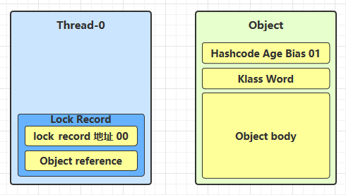
- 让锁记录中 **Object reference 指向锁对象**，并尝试用 cas 替换 Object 的 Mark Word，将 Mark Word 的值存入锁记录（01：无锁；00：轻量级锁，即尝试交换两个锁）

  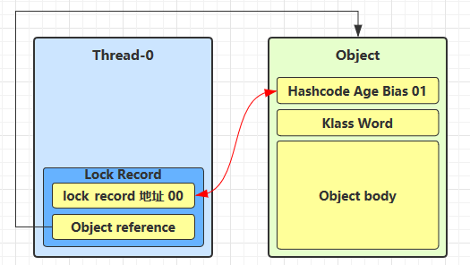
- 如果 cas 替换成功，对象头中存储了**锁记录地址和状态 00**，表示由该线程给对象加锁，这时图示如下

  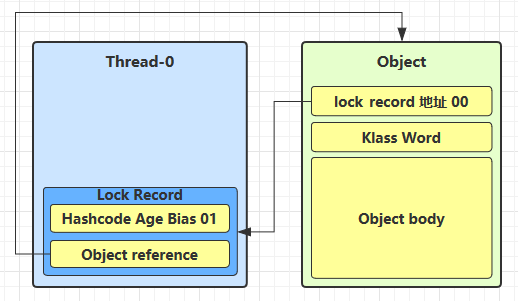
- 如果 cas 失败，有两种情况

  - 如果是**其它线程**已经持有了该 Object 的轻量级锁（该对象持有 00），这时表明**有竞争**，进入**锁膨胀**过程
  - 如果是自己执行了 synchronized **锁重入**，那么再添加一条 **Lock Record 作为重入的计数**（从 lock record 可以得知是否为当前线程加的锁）

  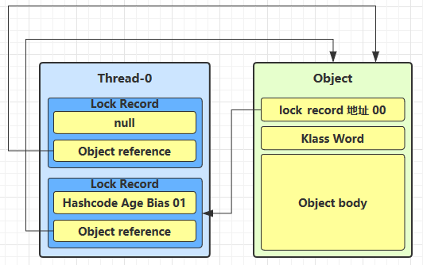
- 当退出 synchronized 代码块（解锁时）如果**有取值为 null 的锁记录，表示有重入**，这时**重置锁记录**，表示重入计数减一

  
- 当退出 synchronized 代码块（解锁时）锁记录的值**不为 null**，这时使用 cas **将 Mark Word 的值恢复给对象头**

  - 成功，则解锁成功
  - 失败，说明轻量级锁进行了锁膨胀或已经升级为重量级锁，进入重量级锁解锁流程

##### 锁膨胀

如果在尝试加轻量级锁的过程中，**CAS 操作无法成功**，这时一种情况就是有其它线程为此对象加上了轻量级锁（**有竞争**），这时需要进行锁膨胀，将轻量级锁变为**重量级锁**

- 当 Thread-1 进行轻量级加锁时，Thread-0 已经对该对象加了轻量级锁

  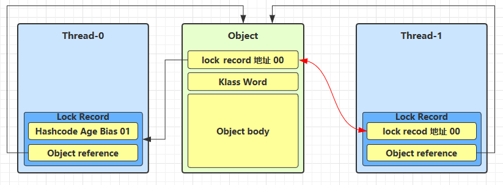
- 这时 Thread-1 加轻量级锁失败，进入锁膨胀流程

  - 即为 Object 对象**申请 Monitor 锁**，让 **Object 指向重量级锁地址**
  - 然后自己进入 Monitor 的 **EntryList BLOCKED**

  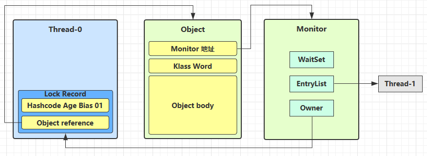

- 当 Thread-0 退出同步块解锁时，使用 cas 将 Mark Word 的值恢复给对象头，失败。这时会进入重量级解锁流程，即**按照 Monitor 地址找到 Monitor 对象，设置 Owner 为 null，唤醒 EntryList 中 BLOCKED 线程**

##### 自旋优化

重量级锁竞争的时候，还可以使用**自旋**来进行优化，如果当前线程自旋成功（即这时候持锁线程已经退出了同步块，释放了锁），这时当前线程就可以避免阻塞

自旋成功：

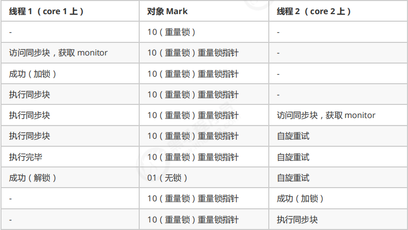

自旋失败：

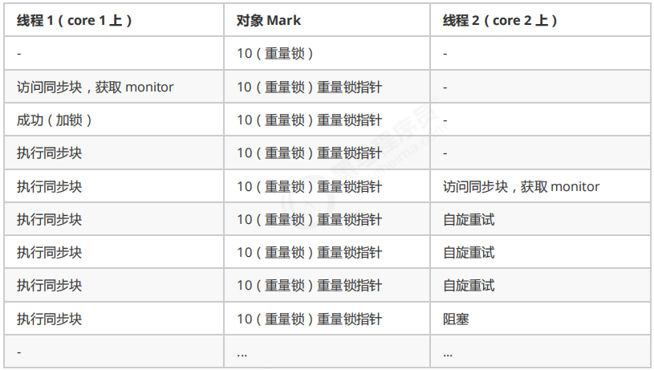

- 自旋会占用 CPU 时间，单核 CPU 自旋无用，多核 CPU 自旋才有用
- 在 Java 6 之后自旋锁是**自适应的**，比如对象刚刚的一次自旋操作成功过，那么认为这次自旋成功的可能性会高，就多自旋几次；反之，就少自旋甚至不自旋
- Java 7 之后不能控制是否开启自旋功能

##### 偏向锁

轻量级锁在没有竞争时，每次**重入**仍然需要执行 CAS 操作。

Java 6 中引入了偏向锁来做进一步优化：第一次使用 CAS 时将**线程 ID** 设置到对象的 Mark Word 头。如果检查线程 ID 是自己，就表示没有竞争，不用重新 CAS。以后只要不发生竞争，这个对象就归该线程所有（即不用尝试交换了）

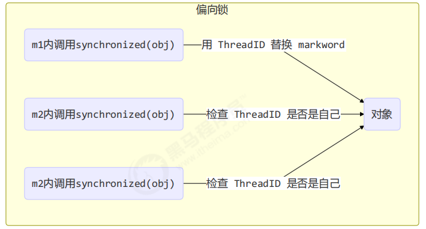

###### 偏向状态

- 如果开启了偏向锁（默认开启），那么对象创建后，markword 值为 0x05 即最后 3 位为 101，这时它的 thread、epoch、age 都为 0
- 偏向锁是默认是**延迟的**，不会在程序启动时立即生效，如果想避免延迟，可以加 VM 参数 `-XX:BiasedLockingStartupDelay=0`​ 来禁用延迟
- 如果没有开启偏向锁，那么对象创建后，markword 值为 0x01 即最后 3 位为 001，这时它的 hashcode、age 都为 0，第一次用到 hashcode 时才会赋值

###### 撤销偏向锁

1. 撤销-hashCode

    - 正常状态对象一开始是没有 hashCode 的，第一次调用才生成
    - 偏向锁的对象 MarkWord 中存储的是线程 id，调用了对象的 hashCode 后，hashCode 无位置存储，会导致偏向锁被撤销，禁用可偏向的对象

      - 轻量级锁：线程栈帧，锁记录中
      - 重量级锁：Monitor 对象中
2. 撤销-其他线程使用对象：当有其他线程使用偏向锁对象时，会将偏向锁升级为轻量级锁
3. 撤销-调用 wait/notify，会变为重量级锁

###### 批量重定向

- 如果对象虽然被多个线程访问，但没有竞争，这时偏向了线程 T1 的对象仍有机会重新偏向 T2，重偏向会重置对象的 Thread ID
- 当撤销偏向锁阈值超过 20 次后，JVM 在给这些对象加锁时**重新偏向至加锁线程**（会将所有对象偏向至加锁线程）

###### 批量撤销

- 当撤销偏向锁阈值超过 40 次后，整个类的所有对象都会变为不可偏向的，新建的对象也是不可偏向的

##### 锁消除

当 JIT 分析锁对象不会逃离方法作用范围时，就会自行优化，删去 synchronized 调用

关闭锁消除：`java -XX:-EliminateLocks -jar benchmarks.jar`​

## 变量的线程安全分析

成员变量和静态变量：

- 如果它们没有共享，则线程安全
- 如果它们被共享了，根据它们的状态是否能够改变，又分两种情况

  - 如果只有读操作，则线程安全
  - 如果有读写操作，则这段代码是临界区，需要考虑线程安全

局部变量：

- 局部变量是线程安全的
- 但局部变量**引用**的对象则未必

  - 如果该对象没有逃离方法的作用访问，它是线程安全的
  - 如果该对象逃离方法的作用范围，需要考虑线程安全

局部变量会在每个线程的栈帧内存中被创建多份，因此不存在共享

```java
public static void test1() {
    int i = 10;
    i++;
}
```

使用 final 和 private 封闭方法，避免子类重写方法导致对象逃离方法的作用范围

## 线程安全类

- String
- Integer
- StringBuffer
- Random
- Vector
- Hashtable
- java.util.concurrent

多个线程调用它们同一个实例的某个方法时，是线程安全的

- 它们的每个方法是原子的
- 但它们多个方法的组合不是原子的（方法与方法之间）

```java
Hashtable table = new Hashtable();
// 线程1，线程2
if( table.get("key") == null) {
	// 这样的两个方法之间存在间隙，就不是原子的，仍然存在线程安全问题
	table.put("key", value);
}
```

### 不可变类线程安全性

String、Integer 等都是不可变类，因为其内部的状态不可以改变，修改类型的方法底层实现都是创建新的对象，它们的方法都是线程安全的

### 实例

1

```java
class MyServlet extends HttpServlet {
    // 引用类型，不安全
    Map&ltString, Object> map = new HashMap&lt>();
    // 不可变类型，安全
    String S1 = "...";
    // 安全
    final String S2 = "...";
    // 引用类型，不安全。需要在临界区修改
    Date D1 = new Date();
    // 引用类型，final修饰不能确保线程安全，不安全
    final Date D2 = new Date();

    public void doGet(HttpServletRequest request, HttpServletResponse response) {
        // 使用上述变量
    }
}
```

2

```java
public class MyServlet extends HttpServlet {
    // 不安全
    private UserService userService = new UserServiceImpl();

    public void doGet(HttpServletRequest request, HttpServletResponse response) {
        userService.update(...);
    }
}
public class UserServiceImpl implements UserService {
    // 记录调用次数
    private int count = 0;

	// 临界区代码，没有做互斥处理，不安全
    public void update() {
        // ...
        count++;
    }
}
```

3

应该使用环绕通知，将成员变量改为局部变量

```java
@Aspect
@Component
public class MyAspect {
    // 对象为单例模式，成员变量不安全
    private long start = 0L;

    @Before("execution(* *(..))")
    public void before() {
		// 会被并发修改
        start = System.nanoTime();
    }

    @After("execution(* *(..))")
    public void after() {
        long end = System.nanoTime();
        System.out.println("cost time:" + (end-start));
    }
}
```

4

```java
public class MyServlet extends HttpServlet {
	// service虽然有成员变量，但是为private，不会被修改，也是安全的
    private UserService userService = new UserServiceImpl();

    public void doGet(HttpServletRequest request, HttpServletResponse response) {
        userService.update(...);
    }
}


public class UserServiceImpl implements UserService {
	// UserDao为无状态变量，虽然是引用变量，但是没有成员变量，线程安全
    private UserDao userDao = new UserDaoImpl();

    public void update() {
        userDao.update();
    }
}

// 没有成员变量，线程安全
public class UserDaoImpl implements UserDao {
    public void update() {
        String sql = "update user set password = ? where username = ?";
		// Connection为局部变量，安全。如果将其改为成员变量，则存在问题
        try (Connection conn = DriverManager.getConnection("","","")){
            // ...
        } catch (Exception e) {
            // ...
        }
    }
}
```

5

```java
public class UserServiceImpl implements UserService {
    public void update() {
        UserDao userDao = new UserDaoImpl();
        userDao.update();
    }
}

public class UserDaoImpl implements UserDao {
    // 虽然有成员变量，但是在service中每次都是创建新的dao，所以也是安全的
    private Connection = null;
    public void update() throws SQLException {
        String sql = "update user set password = ? where username = ?";
        conn = DriverManager.getConnection("","","");
        // ...
        conn.close();
    }
}
```

6

```java
public abstract class Test {

    public void bar() {
        // 是否安全
        SimpleDateFormat sdf = new SimpleDateFormat("yyyy-MM-dd HH:mm:ss");
        foo(sdf);
    }

    public abstract foo(SimpleDateFormat sdf);


    public static void main(String[] args) {
        new Test().bar();
    }
}
```

其中 foo 的行为是不确定的，可能导致不安全的发生，被称之为**外星方法**，所以需要遵循开闭原则，使用 `final`​ 修饰

## Monitor

### Java 对象头

#### 普通对象

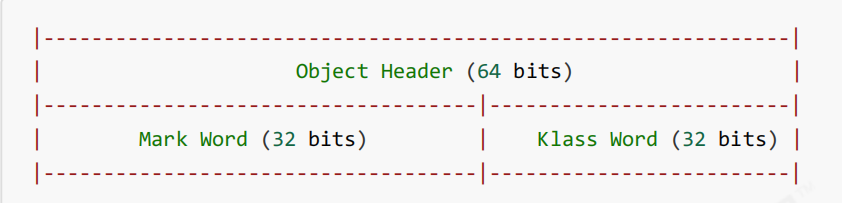

#### 数组对象

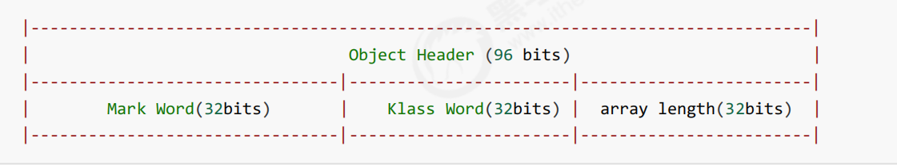

#### Mark Word

- 无锁：01
- 偏向锁：01，通过倒数第三位 `biased_lock` ​来和无锁状态区分
- 轻量级锁：00
- 重量级锁：10

32 位：

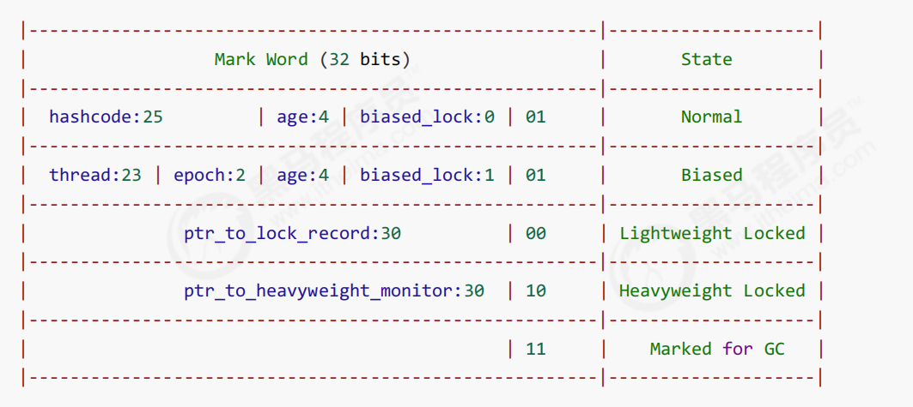

64 位：

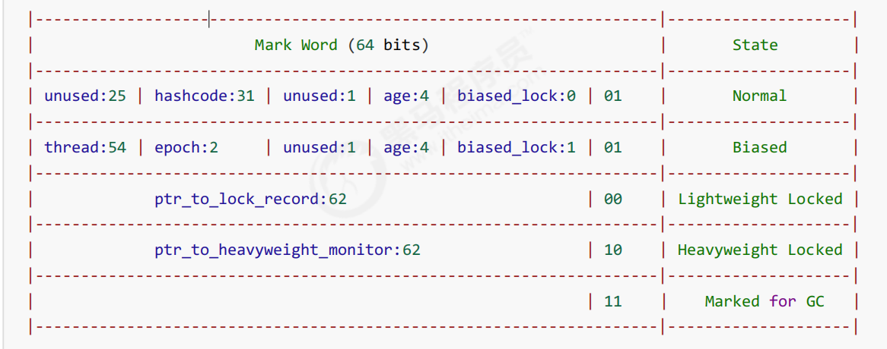

### Monitor 原理

每个 Java 对象都可以关联一个 Monitor 对象（操作系统提供的），如果使用 synchronized 给对象上锁（重量级）之后，该对象头的 Mark Word 中就被设置指向 Monitor 对象的指针

结构：

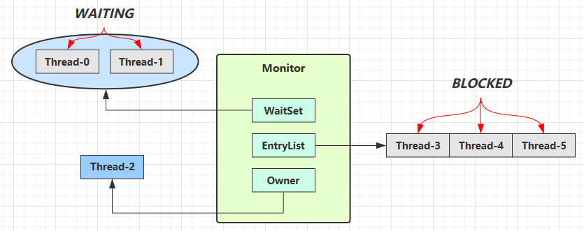

- 刚开始 Monitor 中 Owner 为 null
- 当 Thread-2 执行 `synchronized(obj)`​ 就会将 Monitor 的所有者 Owner 置为 Thread-2，**Monitor 中只能有一个 Owner**
- 在 Thread-2 上锁的过程中，如果 Thread-3，Thread-4，Thread-5 也来执行 `synchronized(obj)`​，就会进入 **EntryList BLOCKED**
- Thread-2 执行完同步代码块的内容，然后唤醒 EntryList 中等待的线程来竞争锁，竞争是**非公平的**
- WaitSet 中的 Thread-0，Thread-1 是之前获得过锁，但条件不满足进入 WAITING 状态的线程

1. synchronized 必须是进入**同一个对象**的 monitor 才有上述的效果
2. 不加 synchronized 的对象不会关联监视器，不遵从以上规则

## wait/notify

- Owner 线程发现条件不满足，调用 wait 方法，即可进入 **WaitSet** 变为 **WAITING 状态**
- BLOCKED 和 WAITING 的线程都处于阻塞状态，不占用 CPU 时间片
- BLOCKED 线程会在 Owner 线程**释放锁**时唤醒
- WAITING 线程会在 Owner 线程**调用 notify 或 notifyAll** 时唤醒，但唤醒后并不意味者立刻获得锁，仍需**进入 EntryList 重新竞争**

### API

|方法|作用|
| ----------------------| --------------------------------------------------------------------------------------------|
|obj.wait()|让进入 object 监视器的线程到 waitSet 等待（无限制等待，timeout = 0）|
|obj.wait(long timeout)|让进入 object 监视器的线程到 waitSet 等待 timeout 毫秒，如果没有 `notify()` ​唤醒，则时间到后继续执行|
|obj.notify()|在 object 上正在 waitSet 等待的线程中挑一个唤醒|
|obj.notifyAll()|让 object 上正在 waitSet 等待的线程全部唤醒|

它们都是线程之间进行协作的手段，都属于 Object 对象的方法。必须获得此对象的锁，才能调用这几个方法

​`wait()` ​会释放获取的锁

### `sleep()` ​与 `wait()`​

1. sleep 是 Thread 方法，而 wait 是 Object 的方法
2. sleep 不需要强制和 synchronized 配合使用，但 **wait 需要和 synchronized 一起用**
3. sleep 在睡眠的同时，**不会释放**对象锁的；wait 在等待的时候**会释放对象锁**
4. 它们状态均为 **TIMED_WAITING**

### 应用

- 必须等待一定时间且需要等待条件准备再执行，如果使用 `sleep()`​，虽然可以满足等待时间，但是无法确保等待条件可以被准备（比如要同一个锁才能准备）

  - 解决方法：wait/notify
- notify 只能随机唤醒一个 WaitSet 中的线程，这时如果有其它线程也在等待，那么就可能唤醒不了正确的线程，称之为**虚假唤醒**

  - 解决方法：`notifyAll()`​
- 用 notifyAll 仅解决某个线程的唤醒问题，但使用 if + wait 判断仅有一次机会，一旦条件不成立，就没有重新判断的机会了

  - 解决方法：while + wait，当条件不成立，再次 wait

```java
synchronized (lock) {
    while (条件不成立) {
        lock.wait();
    }
    // 干活
}

// 另一个线程
synchronized (lock) {
    lock.notifyAll();
}
```

‍

## park/unpark

LockSupport 类中的方法

```java
// 暂停当前线程
LockSupport.park();

// 恢复指定线程的运行
LockSupport.unpark(Thread t);
```

- wait，notify 和 notifyAll 必须配合 Object Monitor 一起使用，而 park，unpark 不必
- park & unpark 是以线程为单位来阻塞和唤醒线程，而 notify() 只能随机唤醒一个等待线程，notifyAll() 是唤醒所有等待线程，就不那么精确
- park & unpark 可以先 unpark，而 wait & notify 不能先 notify

### 原理

每个线程都有自己的一个 Parker 对象，由三部分组成：`_counter`​, `_cond`​, `_mutex`​

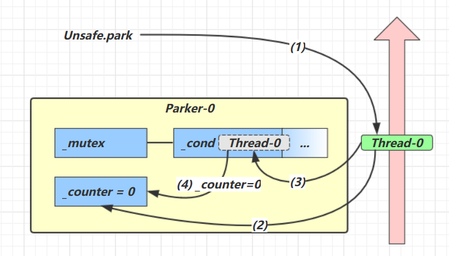

1. 当前线程调用 `Unsafe.park()`​
2. 检查 `_counter`​，若 `_counter` ​为 0，获取 `_mutex` ​互斥锁
3. 线程进入 `_cond` ​条件变量阻塞
4. 设置 `_counter` ​为 0

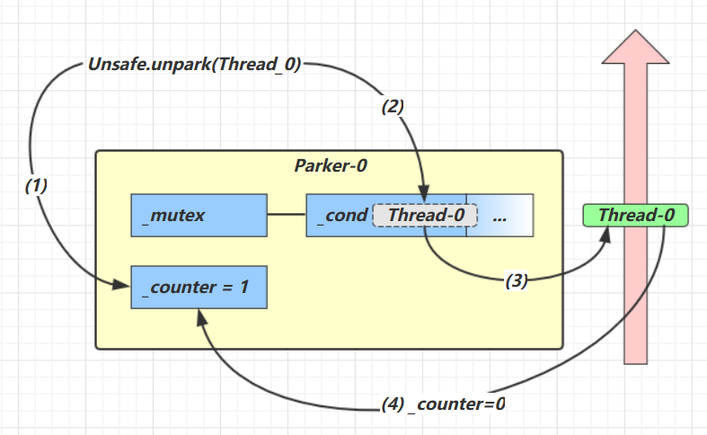

1. 调用 `Unsafe.unpark(Thread_0)`​ 方法，设置 `_counter` ​为 1
2. 唤醒 `_cond` ​条件变量中的 `Thread_0`​
3. ​`Thread_0` ​恢复运行
4. 设置 `_counter` ​为 0

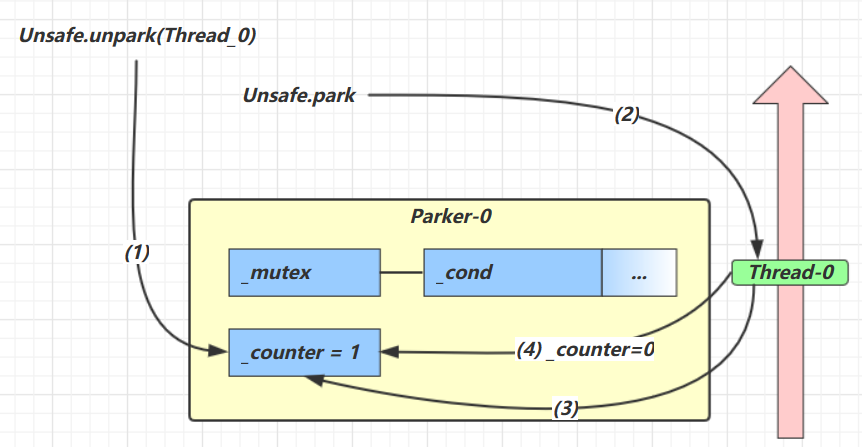

1. 调用 `Unsafe.unpark(Thread_0)`​ 方法，设置 `_counter`​ 为 1
2. 当前线程调用 `Unsafe.park()` ​方法
3. 检查 `_counter`​，本情况为 1，这时线程无需阻塞，继续运行
4. 设置 `_counter` ​为 0

## 多把锁（锁粒度）

- 好处，是可以增强并发度
- 坏处，如果一个线程需要同时获得多把锁，就容易发生死锁

## 活跃性

线程的代码是有限的，但是始终无法结束执行

### 死锁

多个进程在运行过程中因争夺资源而造成的一种僵局，当进程处于这种僵持状态时，若无外力作用，它们都将无法再向前推进。

#### 死锁必要条件

1. 互斥条件
2. 请求和保持条件
3. 不剥夺条件
4. 循环等待条件

#### 死锁定位

1. 使用 jconsole工具
2. 使用 jps 定位进程 id，再用 jstack 定位死锁

```java
"t1" #16 prio=5 os_prio=0 cpu=62.50ms elapsed=33.06s tid=0x000001dc640634e0 nid=0x5b2c waiting for monitor entry  [0x00000008611ff000]
   java.lang.Thread.State: BLOCKED (on object monitor)
        at com.github.zephyrtoria.juc.thread.Test13.lambda$main$0(Test13.java:20)  
        - waiting to lock &lt0x000000062919f6f0> (a java.lang.Object)
        - locked &lt0x000000062919f6e0> (a java.lang.Object)
        at com.github.zephyrtoria.juc.thread.Test13$$Lambda$15/0x000001dc20001200.run(Unknown Source)
        at java.lang.Thread.run(java.base@17.0.14/Thread.java:840)

"t2" #17 prio=5 os_prio=0 cpu=62.50ms elapsed=33.06s tid=0x000001dc6405aca0 nid=0x3ef0 waiting for monitor entry  [0x00000008612ff000]
   java.lang.Thread.State: BLOCKED (on object monitor)
        at com.github.zephyrtoria.juc.thread.Test13.lambda$main$1(Test13.java:35)  
        - waiting to lock &lt0x000000062919f6e0> (a java.lang.Object)
        - locked &lt0x000000062919f6f0> (a java.lang.Object)
        at com.github.zephyrtoria.juc.thread.Test13$$Lambda$18/0x000001dc20001420.run(Unknown Source)
        at java.lang.Thread.run(java.base@17.0.14/Thread.java:840)

```

### 活锁

活锁是拿到资源却又相互释放不执行。当多线程中出现了相互谦让，都主动将资源释放给别的线程使用，这样这个资源在多个线程之间跳动而又得不到执行

解决方法：设置执行时间使得线程交错执行，可以增加随机时间

### 饥饿

- 优先级高的线程能够插队并优先执行，这样如果优先级高的线程一直抢占优先级低线程的资源，导致低优先级线程无法得到执行
- 一个线程一直占着一个资源不放而导致其他线程得不到执行

## ReentrantLock

相对于 synchronized 它具备如下特点

- **可中断**
- 可以设置**超时时间**
- 可以设置为**公平锁**
- 支持**多个条件变量**

与 synchronized 一样，都**支持可重入**

```java
ReentrantLock lock = new ReentrantLock();
// 获取锁
lock.lock();
try {
    // 临界区
    System.out.println(lock.isLocked());   
} finally {
    // 释放锁
    lock.unlock();
}
```

### 可重入

- 可重入是指同一个**线程**如果首次获得了这把锁，那么因为它是这把锁的拥有者，因此有权利**再次获取这把锁**
- 如果是不可重入锁，那么第二次获得锁时，自己也会被锁挡住

### 可打断

需要使用 `lock.lockInterruptibly()`​

```java
ReentrantLock reentrantLock = new ReentrantLock();
Thread t1 = new Thread(() -> {
    LogUtil.log("start");
    try {
        reentrantLock.lockInterruptibly();
    } catch (InterruptedException e) {
        e.printStackTrace();
        LogUtil.log("interrupted");
        return;
    }
    try {
        LogUtil.log("get lock");
    } finally {
        reentrantLock.unlock();
    }
}, "t1");

reentrantLock.lock();
LogUtil.log("get lock");
t1.start();
try {
    Thread.sleep(1000);
    t1.interrupt();
    LogUtil.log("interrupt");
} finally {
    reentrantLock.unlock();
}
}
```

如果是不可中断模式（使用`lock.lock()`​），那么即使使用`interrupt()`​ 也不会让等待中断

### 锁超时

立刻失败

‍

超时失败

‍

# 线程共享-内存

## Java 内存模型

## 可见性

## 有序性

## 原子性

# 线程共享-无锁

# 线程共享-不可变

# 线程共享-工具
