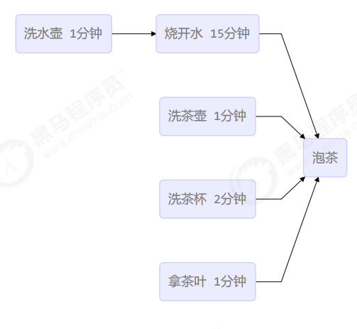
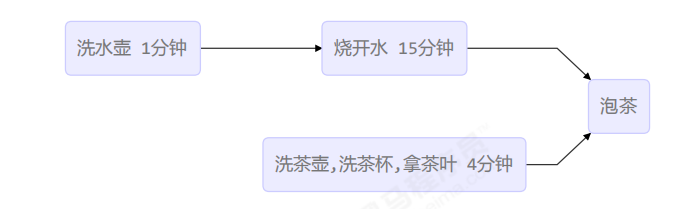

# 应用

# 效率

# 限制

# 互斥

## 悲观互斥

## 乐观重试

‍

# 同步和异步

# 缓存

# 分治

# 统筹

## 烧水泡茶





用两个线程（两个人协作）模拟烧水泡茶过程

### `join()`​ 实现

```java
public class Test1 {
    public static void main(String[] args) throws InterruptedException {
        // 烧水
        Thread t1 = new Thread(() -> {
            try {
                LogUtil.log("洗水壶");
                Thread.sleep(100);
                LogUtil.log("烧水");
                Thread.sleep(1500);
            } catch (InterruptedException e) {
                throw new RuntimeException(e);
            }
        }, "t1");

        // 其他
        Thread t2 = new Thread(() -> {
            try {

                LogUtil.log("洗茶壶");
                Thread.sleep(100);
                LogUtil.log("洗茶杯");
                Thread.sleep(200);
                LogUtil.log("拿茶叶");
                Thread.sleep(100);
                t1.join();
                LogUtil.log("泡茶");
            } catch (InterruptedException e) {
                throw new RuntimeException(e);
            }
        }, "t2");

        t1.start();
        t2.start();
    }
}


------------------------------
[Log] [t2] 10:20:14:569: 洗茶壶
[Log] [t1] 10:20:14:569: 洗水壶
[Log] [t2] 10:20:14:734: 洗茶杯
[Log] [t1] 10:20:14:734: 烧水
[Log] [t2] 10:20:14:938: 拿茶叶
[Log] [t2] 10:20:16:238: 泡茶
```

两个线程是各执行各的

### `wait()/notify()`​实现

‍

### 第三者协调实现

# 定时
