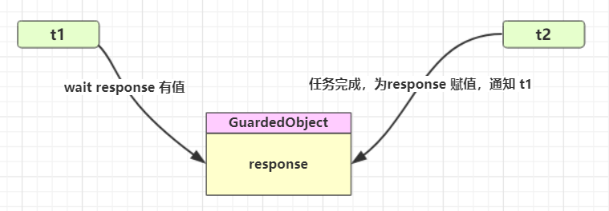
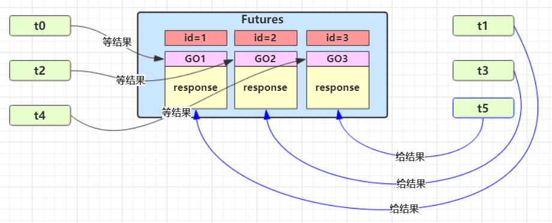
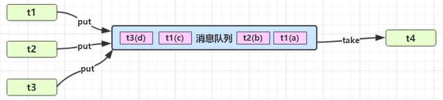
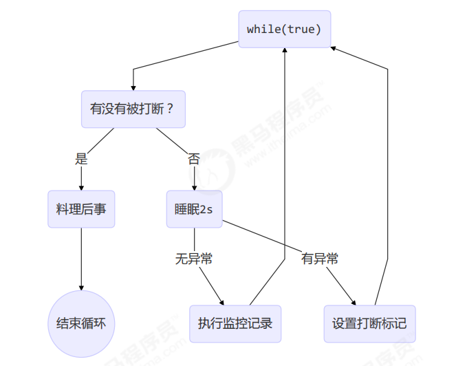

# 模式

# 同步模式

## 保护性暂停

即 Guarded Suspension，用在**一个线程等待另一个线程的执行结果（需要强对应）**

- 有**一个结果**需要从一个线程传递到另一个线程，让他们**关联同一个 GuardedObject**
- 如果有结果**不断**从一个线程到另一个线程那么可以使用**消息队列**（见生产者/消费者）
- JDK 中，join 的实现、Future 的实现，采用的就是此模式
- 因为要等待另一方的结果，因此归类到同步模式



### 实现

```java
public class GuardedObject {
    // 存储结果
    private Object response;

    // 获取结果
    public Object get() {
        synchronized (this) {
            // 条件不足则等待
            while (response == null) {
                try {
                    this.wait();
                } catch (InterruptedException e) {
                    throw new RuntimeException(e);
                }
            }
            return response;
        }
    }

    // 存放结果
    public void set(Object response) {
        synchronized (this) {
            this.response = response;
            lock.notifyAll();
        }
    }
}

```

### 应用

```java
public static void main(String[] args) {
    GuardedObject guardedObject = new GuardedObject();
    new Thread(() -> {
        Object response = guardedObject.get();
        LogUtil.log("Response: " + response);
    }).start();

    new Thread(() -> {
        guardedObject.set("Guarded Object");
    }).start();
}
```

- ​`join()`​需要等待整个线程运行结束；而这种方法不需要整个线程运行结束再响应
- 可以各自创建局部变量，不需要全局变量进行传递

### 超时实现

```java
public class GuardedObject {
    // 存储结果
    private Object response;

    // 获取结果
    public Object get(long timeout) {
        synchronized (this) {
            // 条件不足则等待
            // 开始时间
            long begin = System.currentTimeMillis();
            // 经历时间
            long passedTime = 0;
            while (response == null) {
                // 这一轮循环需要等待时间
                long waitTime = timeout - passedTime;
                // 经历时间超过最大等待时间，退出循环
                if (waitTime <= 0) {
                    break;
                }
                try {
                    this.wait(waitTime);
                } catch (InterruptedException e) {
                    throw new RuntimeException(e);
                }
                // 更新经历时间
                passedTime = System.currentTimeMillis() - begin;
            }
            return response;
        }
    }

    // 存放结果
    public void set(Object response) {
        synchronized (this) {
            this.response = response;
            this.notifyAll();
        }
    }
}
```

​`wait()`​中不能填入`timeout`​，因为会有虚假唤醒的情况，导致等待时间不变

### 多任务版

如果需要在多个类之间使用 GuardedObject 对象，作为参数传递不是很方便，因此设计一个用来解耦的中间类，这样不仅能够解耦结果**等待者**和结果**生产者**，还能够同时支持多个任务的管理

多见于 RPC 框架



新增id标记 Guarded Object

```java
public class GuardedObject {
    // 存储结果
    private Object response;

    @Getter
    private final int id;

    public GuardedObject(int id) {
        this.id = id;
    }

    // 获取结果
    public Object get(long timeout) {
        synchronized (this) {
            // 条件不足则等待
            // 开始时间
            long begin = System.currentTimeMillis();
            // 经历时间
            long passedTime = 0;
            while (response == null) {
                // 这一轮循环需要等待时间
                long waitTime = timeout - passedTime;
                // 经历时间超过最大等待时间，退出循环
                if (waitTime <= 0) {
                    break;
                }
                try {
                    this.wait(waitTime);
                } catch (InterruptedException e) {
                    throw new RuntimeException(e);
                }
                // 更新经历时间
                passedTime = System.currentTimeMillis() - begin;
            }
            return response;
        }
    }

    // 存放结果
    public void set(Object response) {
        synchronized (this) {
            this.response = response;
            this.notifyAll();
        }
    }
}
```

中间解耦邮箱类

```java
public class Mailboxes {
    private static final Map<Integer, GuardedObject> boxes = new HashMap<>();
    
    private static int id = 1;

    // 产生唯一id
    private static synchronized int generateId() {
        return id++;
    }
    
    public static GuardedObject createGuardedObject() {
        GuardedObject go = new GuardedObject(generateId());
        boxes.put(go.getId(), go);
        return go;
    }
    
    public static Set<Integer> getIds() {
        return boxes.keySet();
    }
}
```

生产者

```java
class PostMan extends Thread {
    private final int id;
    private final String message;

    public PostMan(int id, String message) {
        this.id = id;
        this.message = message;
    }

    @Override
    public void run() {
        // 送信
        GuardedObject go = Mailboxes.getGuardedObject(id);
        LogUtil.log("PostMan post #" + id);
        go.set(message);
    }
}
```

等待者

```java
class People extends Thread {
    @Override
    public void run() {
        // 收信
        GuardedObject go = Mailboxes.createGuardedObject();
        LogUtil.log("People started: " + go.getId());
        Object mail = go.get(1000);
        LogUtil.log("People finished: " + mail);
    }
}
```

测试

```java
for (int i = 0; i < 3; i++) {
    new People().start();
}
Thread.sleep(1000);
for (Integer id : Mailboxes.getIds()) {
    new PostMan(id, "Message" + id).start();
}
```

## Balking

Balking（犹豫）模式用在一个线程发现另一个线程或本线程已经做了某一件相同的事，那么本线程就无需再做了，直接结束返回

## 顺序控制

# 异步模式

## 生产者消费者模式

- 与前面的保护性暂停中的 GuardObject 不同，**不需要产生结果和消费结果的线程一一对应**
- 消费队列可以用来平衡生产和消费的线程资源
- 生产者仅负责产生结果数据，不关心数据该如何处理，而消费者专心处理结果数据
- 消息队列是有**容量限制**的，满时不会再加入数据，空时不会再消耗数据
- JDK 中各种阻塞队列，采用的就是这种模式



### 实现

```java
// 线程间通信类
public class MessageQueue {
    public static final class Message {
        private final long id;
        private final Object value;

        public Message(long id, Object value) {
            this.id = id;
            this.value = value;
        }
    }

    // 双向队列存储信息
    private final Deque<Message> list = new LinkedList<>();
    // 队列容量
    private final int capacity;

    public MessageQueue(int capacity) {
        this.capacity = capacity;
    }

    // 获取消息
    public Message take() {
        // 检查对象是否为空
        synchronized (list) {
            while (list.isEmpty()) {
                try {
                    list.wait();
                } catch (InterruptedException e) {
                    throw new RuntimeException(e);
                }
            }
            Message message = list.removeFirst();
            list.notifyAll();
            return message;
        }
    }

    // 存入消息
    public void put(Message message) {
        synchronized (list) {
            while (list.size() >= capacity) {
                try {
                    list.wait();
                } catch (InterruptedException e) {
                    throw new RuntimeException(e);
                }
            }
            list.addLast(message);
            list.notifyAll();
        }
    }
}
```

## 工作线程

‍

# 终止模式

## 两阶段终止模式 Two Phase Termination

线程终止的错误思路：

- ​`stop()`​

  - ​`stop()`​会杀死线程，如果线程锁住了共享资源，那么杀死该线程之后就没有机会释放这些资源了，其他线程的运行会受到影响
- ​`System.exit(int)`​

  - 会导致整个程序停止

两阶段终止模式流程：



### 使用 interrupt

```java
public class Test7 {
    public static void main(String[] args) throws InterruptedException {
        TwoPhaseTermination termination = new TwoPhaseTermination();
        termination.start();
        Thread.sleep(3500);
        termination.stop();
    }
}

class TwoPhaseTermination {
    private Thread monitor;

    // 启动监控线程
    public void start() {
        monitor = new Thread(() -> {
            while (true) {
                Thread thread = Thread.currentThread();
                if (thread.isInterrupted()) {
                    System.out.println("interrupted, dealing with monitor");
                    break;
                }
                try {
                    Thread.sleep(1000);
                    System.out.println("执行监控记录");
                } catch (InterruptedException e) {
                    e.printStackTrace();
                    // 重新设置打断标记，下次再进入循环时就可以正常退出
                    thread.interrupt();
                }
            }
        });
        monitor.start();
    }

    public void stop() {
        monitor.interrupt();
    }
}
```

注意：`sleep()`​被打断后会抛出异常，但是不会导致线程结束，仍会正常执行死循环，所以需要在处理异常时手动修改打断标记，这样才能在下次进入循环时正常退出

### 使用停止标记

# 单例模式

## 饿汉单例

## 懒汉单例

## 枚举单例

‍

# 享元模式
